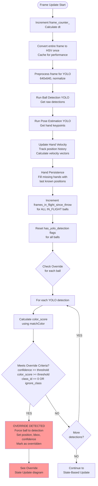
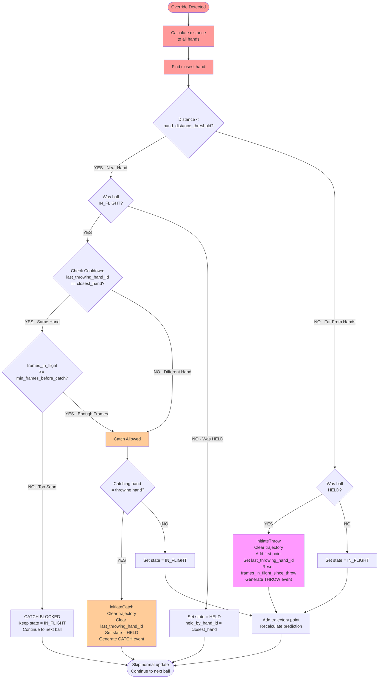
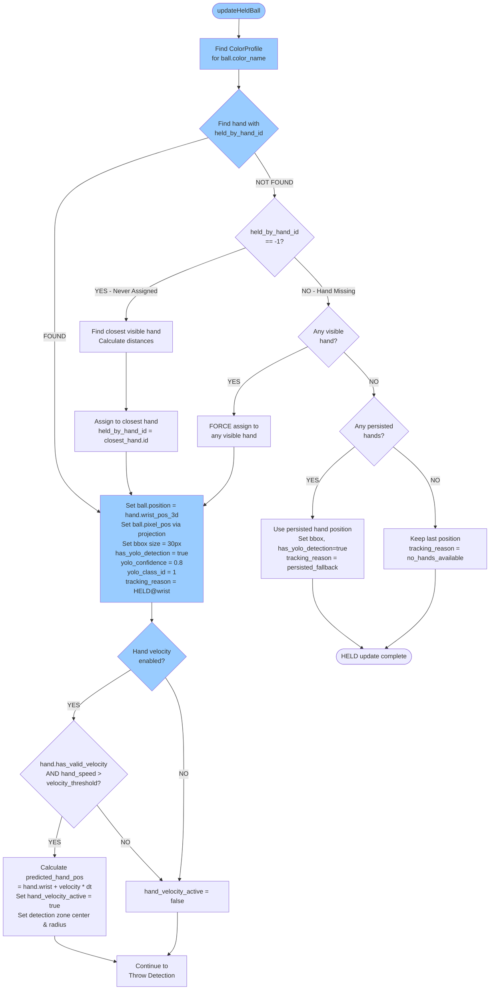
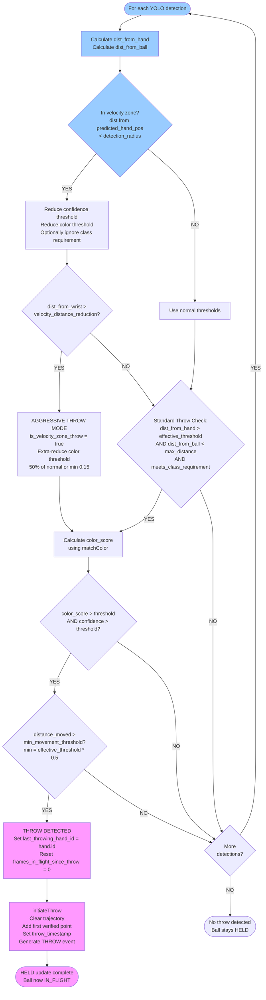
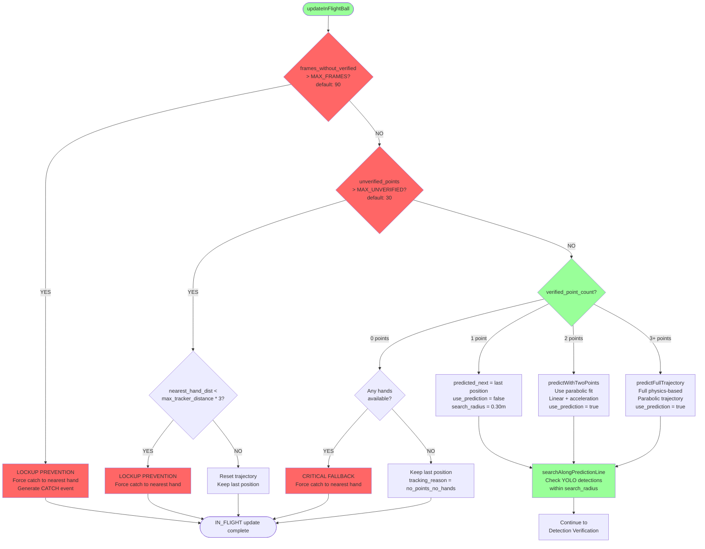
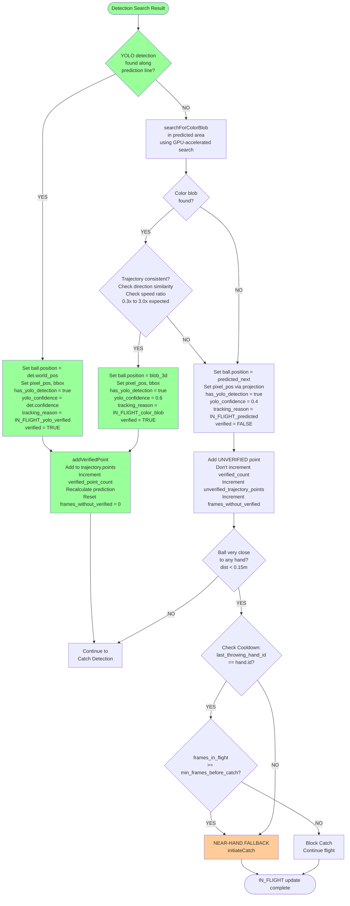
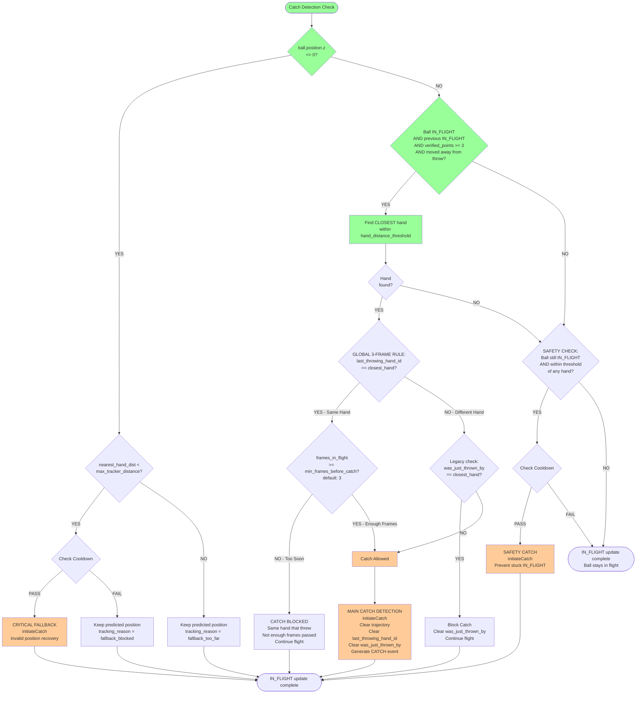

# SimpleBallTracker 3D - Complete Tracker Placement Decision Flow

This document contains detailed mermaid diagrams showing how the SimpleBallTracker 3D system determines tracker positions for each ball. The flow is broken into sections for readability.

---

## 1. Frame Initialization & Override Check

---

## 2. Override State Update (Distance-Based)

---

## 3. HELD Ball Update - Position & Hand Assignment

---

## 4. HELD Ball Update - Throw Detection

---

## 5. IN_FLIGHT Ball Update - Lockup Prevention & Prediction

---

## 6. IN_FLIGHT Ball Update - Detection Verification

---

## 7. IN_FLIGHT Ball Update - Catch Detection

---

## Summary: Tracker Placement Priority

### For Each Ball, Per Frame:

1. **Override Check** (Highest Priority)
   - If detection meets high confidence + color + class requirements
   - Force ball to detection position immediately
   - Update state based on distance to hands (not YOLO class)

2. **HELD Ball** (if not overridden)
   - Position: Always at hand wrist
   - Check for throw: Detection moving away from hand
   - Velocity zone: Reduced thresholds if hand moving fast

3. **IN_FLIGHT Ball** (if not overridden)
   - Lockup prevention checks first
   - Prediction based on point count (0/1/2/3+)
   - Detection priority: YOLO → Color blob → Predicted
   - Multiple catch detection paths with cooldown

4. **Cooldown System** (GLOBAL 3-FRAME RULE)
   - Applies to ALL catch detection paths
   - Prevents same-hand re-catch for 3 frames
   - Uses `last_throwing_hand_id` + `frames_in_flight_since_throw`

---

*Generated: 2025-10-14*
*Last Updated: 2025-10-14 12:18 UTC*