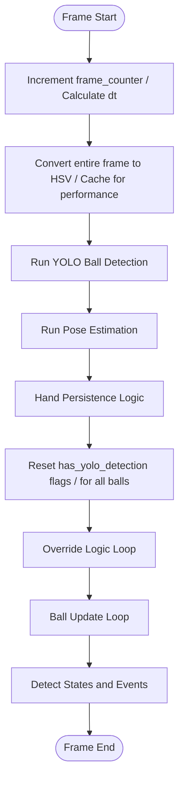
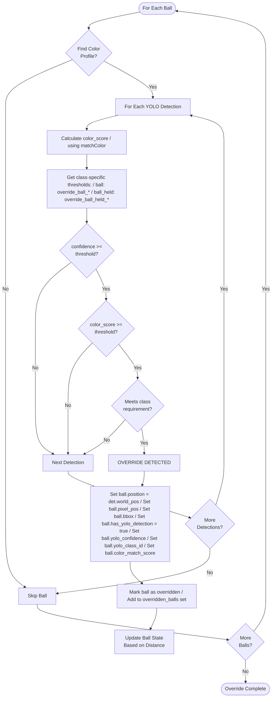
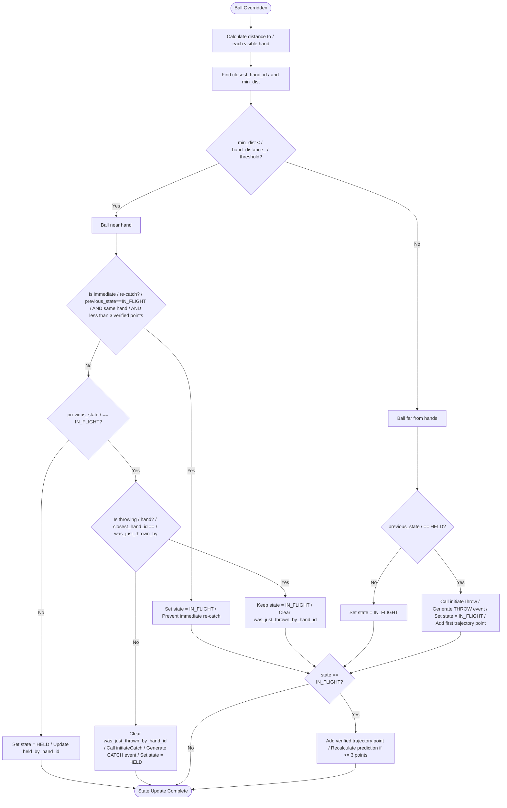
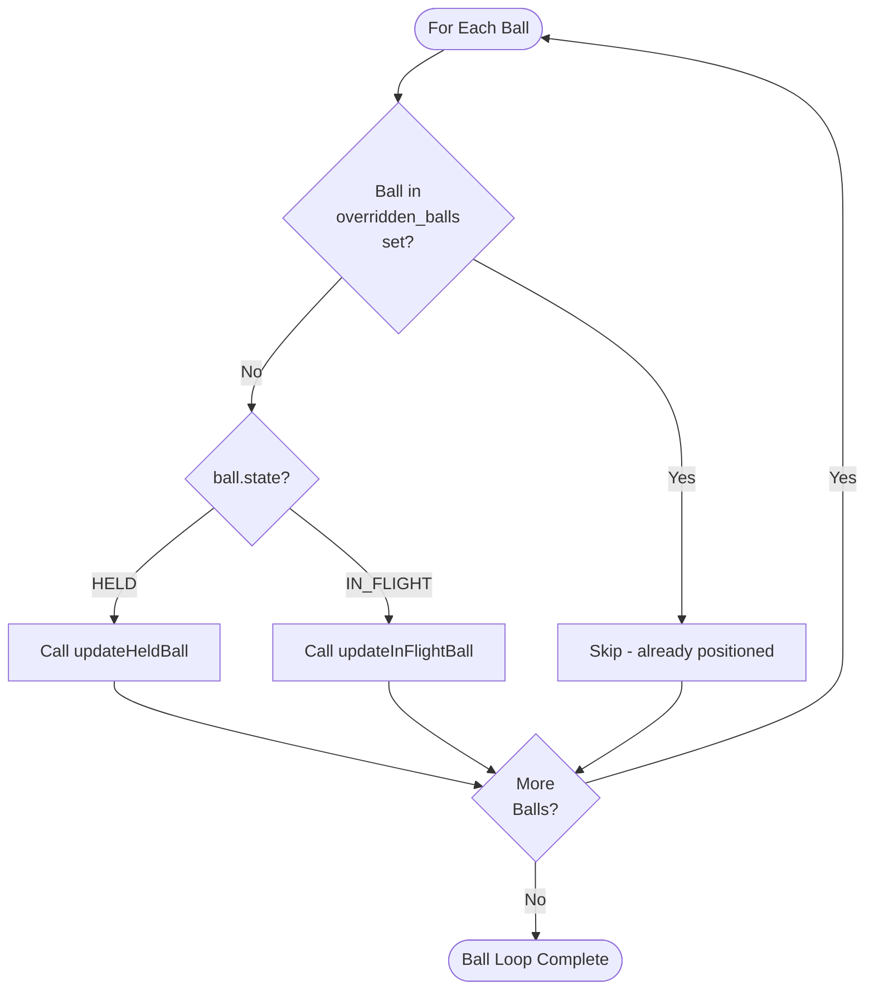
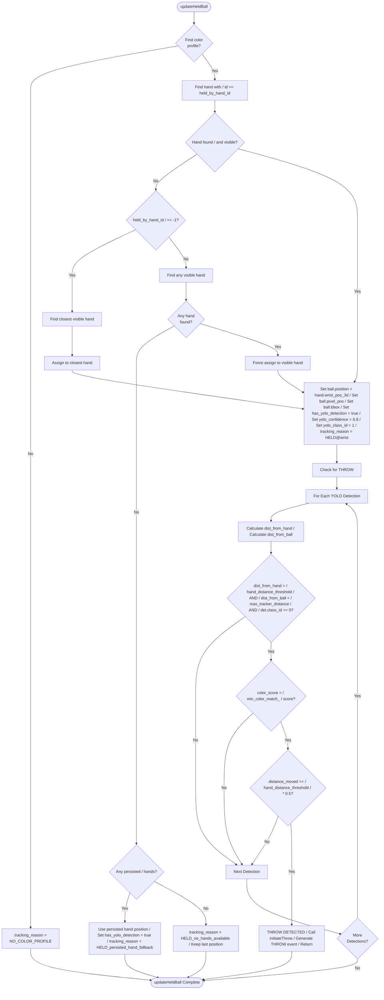
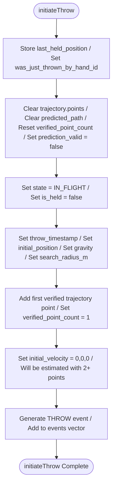
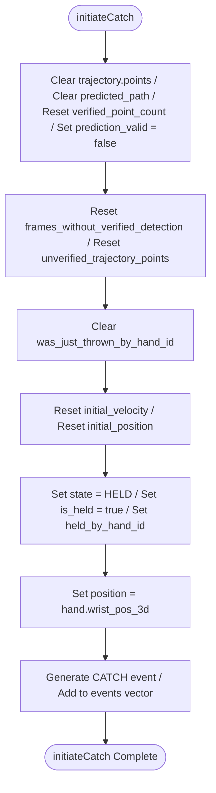

# Ball Tracking Flow Diagram

This document provides a complete, step-by-step representation of the ball tracking logic in SimpleBallTracker, showing every check and decision made when identifying balls and deciding where to put trackers each frame.

## High-Level Frame Processing Flow

## Detailed Override Logic (Per Ball)

## Override State Update (Distance-Based)

## Ball Update Loop (Non-Overridden Balls)

## updateHeldBall - Detailed Flow

## updateInFlightBall - Detailed Flow

```mermaid
flowchart TD
    Start([updateInFlightBall]) --> CheckLockup1{frames_without_ / verified_detection > / 90?}
    
    CheckLockup1 -->|Yes| ForceCatch1[Find nearest hand / Force catch]
    CheckLockup1 -->|No| CheckLockup2{unverified_ / trajectory_points > / 30?}
    
    CheckLockup2 -->|Yes| ForceCatch2[Find nearest hand within 3x max_distance / Force catch or reset trajectory]
    CheckLockup2 -->|No| CheckPoints{verified_point_ / count?}
    
    CheckPoints -->|0| ForceCatch3[CRITICAL: No points / Force catch to nearest hand]
    CheckPoints -->|1| SearchLast[predicted_next = last point / use_prediction = false]
    CheckPoints -->|2| TwoPoint[Use predictWithTwoPoints / use_prediction = true]
    CheckPoints -->|>=3| FullPhysics[Use predictFullTrajectory / use_prediction = true]
    
    SearchLast --> SearchDet[Search for detection]
    TwoPoint --> SearchDet
    FullPhysics --> SearchDet
    
    SearchDet --> CallSearch[Call searchAlongPredictionLine / with search_radius]
    CallSearch --> DetFound{Detection<br/>found?}
    
    DetFound -->|Yes| UseYolo[Use YOLO detection / Set position, bbox, confidence / tracking_reason = IN_FLIGHT_yolo_verified / verified = true]
    DetFound -->|No| ColorBlob[Try color blob search]
    
    ColorBlob --> BlobFound{Color blob / found and / trajectory / consistent?}
    
    BlobFound -->|Yes| UseBlob[Use color blob position / Set has_yolo_detection = true / tracking_reason = IN_FLIGHT_color_blob / verified = true]
    BlobFound -->|No| UsePredicted[Use predicted position / Set has_yolo_detection = true / tracking_reason = IN_FLIGHT_predicted / verified = false]
    
    UseYolo --> AddPoint{verified?}
    UseBlob --> AddPoint
    UsePredicted --> AddPoint
    
    AddPoint -->|Yes| AddVerified[Call addVerifiedPoint / Recalculate prediction if >= 3 points]
    AddPoint -->|No| AddUnverified[Add unverified trajectory point / Check near-hand fallback]
    
    AddVerified --> CheckInvalid{ball.position.z / <= 0?}
    AddUnverified --> CheckInvalid
    
    CheckInvalid -->|Yes| ForceCatch4[Force catch to nearest hand / if within max_tracker_distance]
    CheckInvalid -->|No| CatchCheck[Check for CATCH]
    
    CatchCheck --> CheckCatchState{state == IN_FLIGHT / AND / previous_state == / IN_FLIGHT?}
    
    CheckCatchState -->|No| SafetyCheck[Safety catch check]
    CheckCatchState -->|Yes| CheckMinPoints{verified_point_count / >= 3?}
    
    CheckMinPoints -->|No| SafetyCheck
    CheckMinPoints -->|Yes| CheckMovedAway{Ball moved away / from throw position?}
    
    CheckMovedAway -->|No| SafetyCheck
    CheckMovedAway -->|Yes| FindCatchHand[Find closest hand within threshold / Skip throwing hand if < 10 verified points]
    
    FindCatchHand --> CatchHandFound{Closest hand<br/>found?}
    
    CatchHandFound -->|No| SafetyCheck
    CatchHandFound -->|Yes| CheckThrowingHand{Is throwing / hand? / id == was_just_ / thrown_by}
    
    CheckThrowingHand -->|Yes| PreventCatch[Clear was_just_thrown_by_hand_id / Don't catch]
    CheckThrowingHand -->|No| InitCatch[Clear was_just_thrown_by_hand_id / Call initiateCatch / Generate CATCH event / Return]
    
    SafetyCheck --> SafetyLoop[For each hand]
    SafetyLoop --> CheckSafetyDist{dist_to_hand < / hand_distance_ / threshold?}
    
    CheckSafetyDist -->|Yes| SafetyCatch[SAFETY CATCH / Force catch immediately / Return]
    CheckSafetyDist -->|No| NextHand{More<br/>hands?}
    
    NextHand -->|Yes| SafetyLoop
    NextHand -->|No| End([updateInFlightBall Complete])
    
    PreventCatch --> SafetyCheck
    ForceCatch1 --> End
    ForceCatch2 --> End
    ForceCatch3 --> End
    ForceCatch4 --> End
    InitCatch --> End
    SafetyCatch --> End
```

## initiateThrow - State Transition

## initiateCatch - State Transition

## Key Decision Points Summary

### Override Logic
1. **Color Match**: `color_score >= threshold` (class-specific)
2. **Confidence**: `confidence >= threshold` (class-specific)
3. **Class Requirement**: `!override_require_ball_class || class_id == 0`

### Throw Detection (from HELD)
1. **Distance from Hand**: `dist_from_hand > hand_distance_threshold`
2. **Distance from Ball**: `dist_from_ball < max_tracker_distance_per_frame`
3. **Class Check**: `det.class_id == 0` (must be 'ball', not 'ball_held')
4. **Color Match**: `color_score > min_color_match_score`
5. **Movement**: `distance_moved >= hand_distance_threshold * 0.5`

### Catch Detection (from IN_FLIGHT)
1. **State Check**: `state == IN_FLIGHT && previous_state == IN_FLIGHT`
2. **Minimum Points**: `verified_point_count >= 3`
3. **Moved Away**: `distance_from_throw >= hand_distance_threshold`
4. **Hand Distance**: `dist_to_hand < hand_distance_threshold`
5. **Not Throwing Hand**: `hand.id != was_just_thrown_by_hand_id` (or >= 10 verified points)

### State Determination (Override)
1. **Near Hand**: `min_dist < hand_distance_threshold` → HELD (with re-catch prevention)
2. **Far from Hands**: `min_dist >= hand_distance_threshold` → IN_FLIGHT (generate throw if was HELD)

## Timestamp
Last Updated: 2025-10-12T10:15:00Z