# Ball Tracking System - Visual Diagrams
**Date:** 2025-01-04  
**Purpose:** Visual representation of the color-dominated tracking system

---

## System Architecture Comparison

### OLD SYSTEM (Prediction-Based)
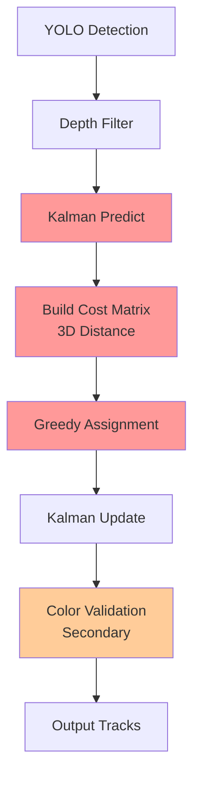

### NEW SYSTEM (Color-Dominated)
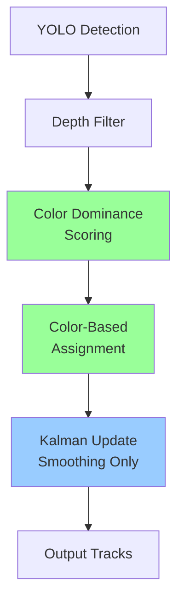

---

## Frame Processing Pipeline

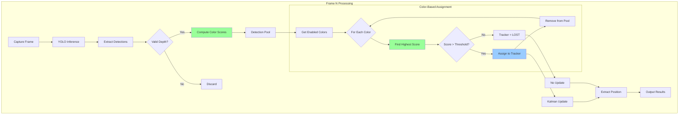

---

## Color Dominance Scoring

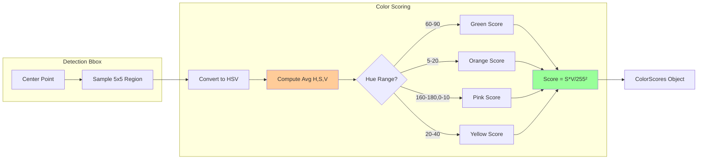

---

## Assignment Algorithm

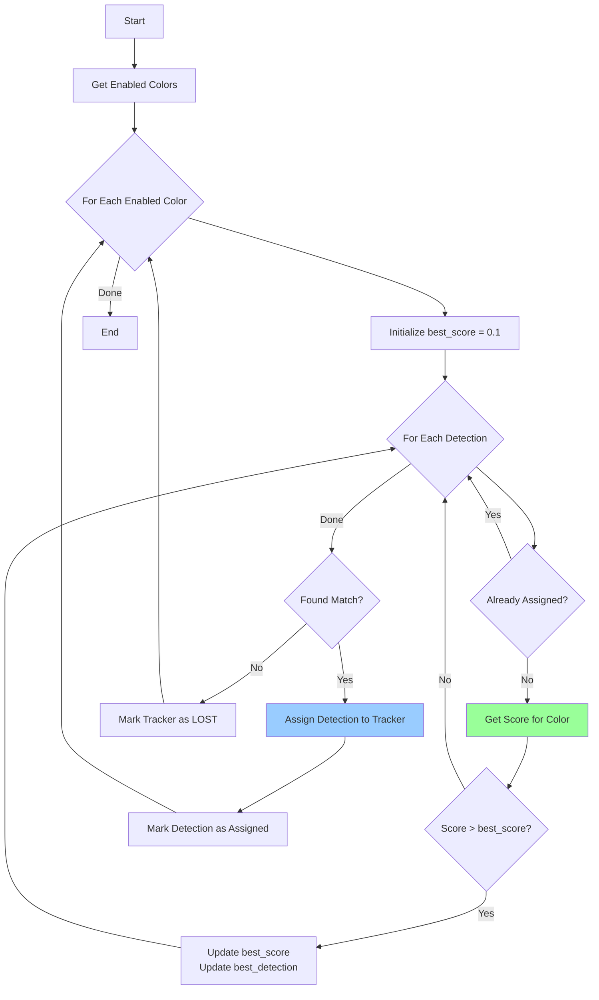

---

## Tracker Lifecycle

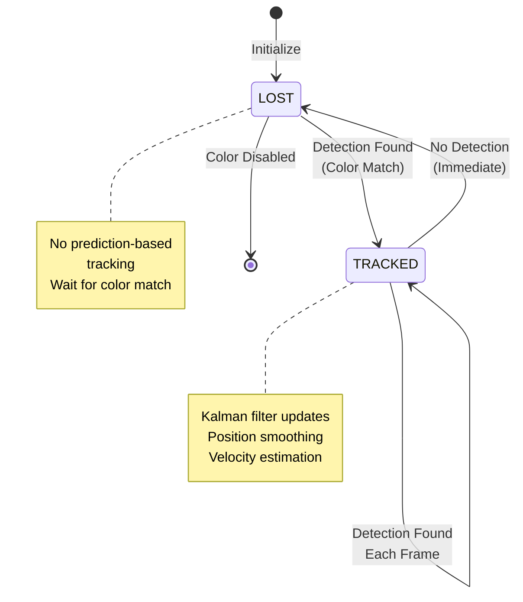

---

## Color Profile Integration

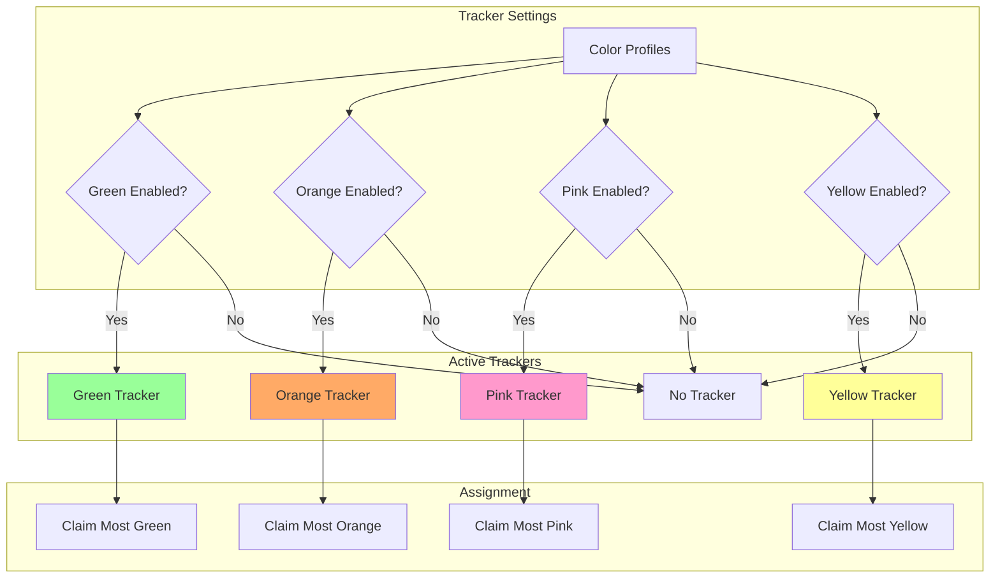

---

## Example: 3-Ball Juggling

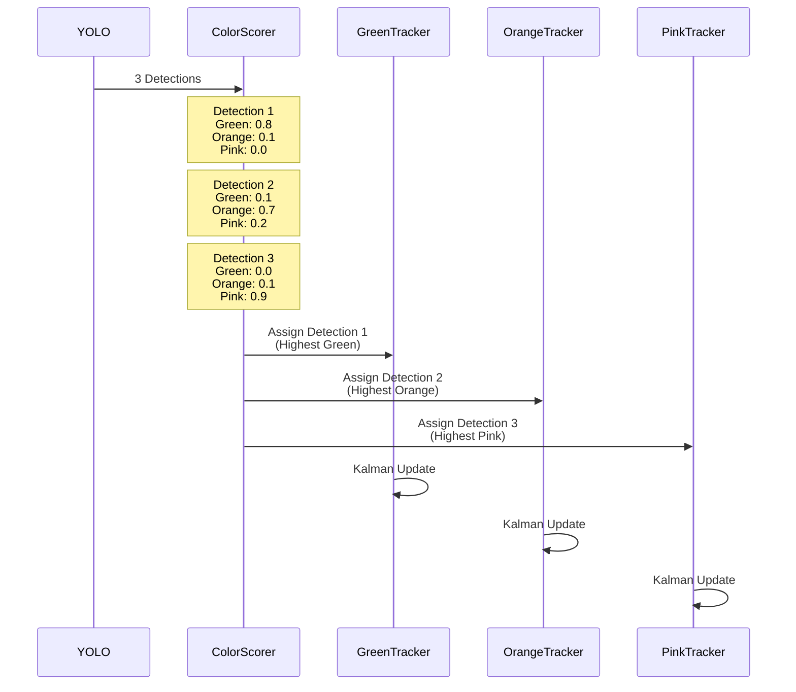

---

## Edge Case: Ambiguous Colors

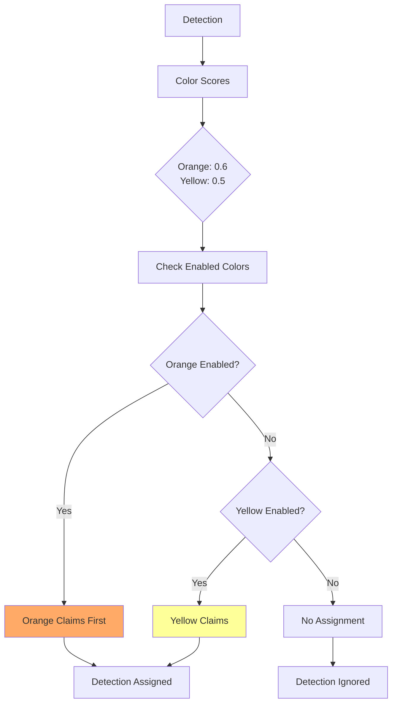

---

## Performance Comparison

```mermaid
graph LR
    subgraph Old["OLD SYSTEM"]
        A1[O(N*M) Cost Matrix] --> A2[O(N*M) Assignment]
        A2 --> A3[Total: O(N²)]
    end
    
    subgraph New["NEW SYSTEM"]
        B1[O(N) Color Scoring] --> B2[O(C*N) Assignment]
        B2 --> B3[Total: O(N)]
    end
    
    A3 -.->|Slower| C[Performance]
    B3 -.->|Faster| C
    
    style A3 fill:#ff9999
    style B3 fill:#99ff99
```

Where:
- N = Number of detections
- M = Number of trackers
- C = Number of enabled colors (typically 2-4)

---

## Data Flow

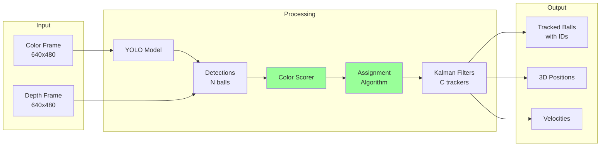

---

## Memory Layout

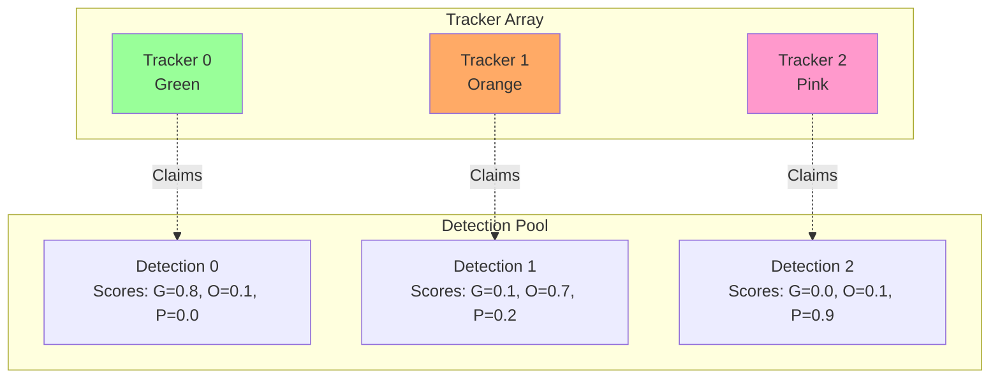

---

## Conclusion

The new color-dominated system is:
- **Simpler**: Linear algorithm instead of quadratic
- **More robust**: Color identity is stable
- **More predictable**: 1:1 mapping between colors and trackers
- **Faster**: O(N) instead of O(N²)

The diagrams above illustrate how the system leverages color as the primary identity mechanism, with Kalman filters used only for smoothing and velocity estimation.