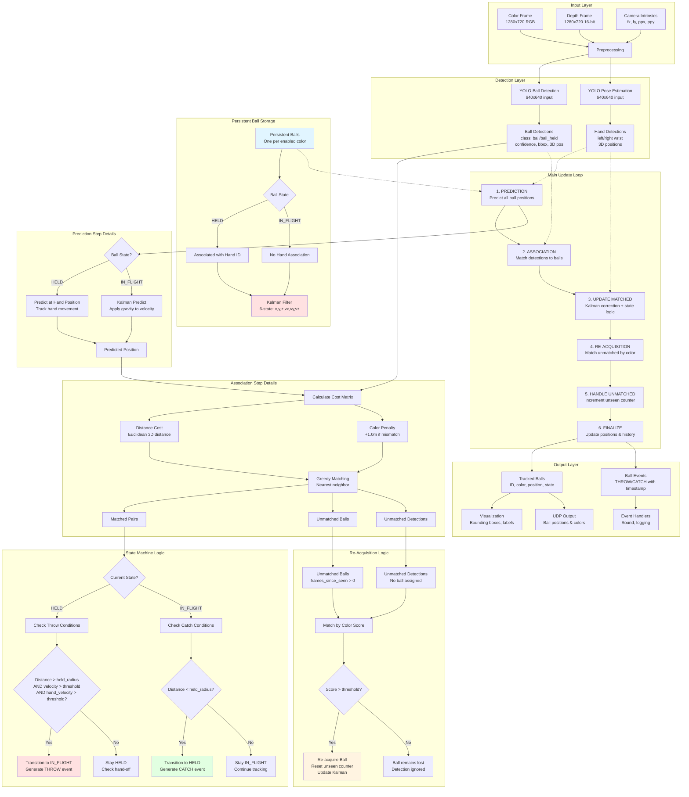
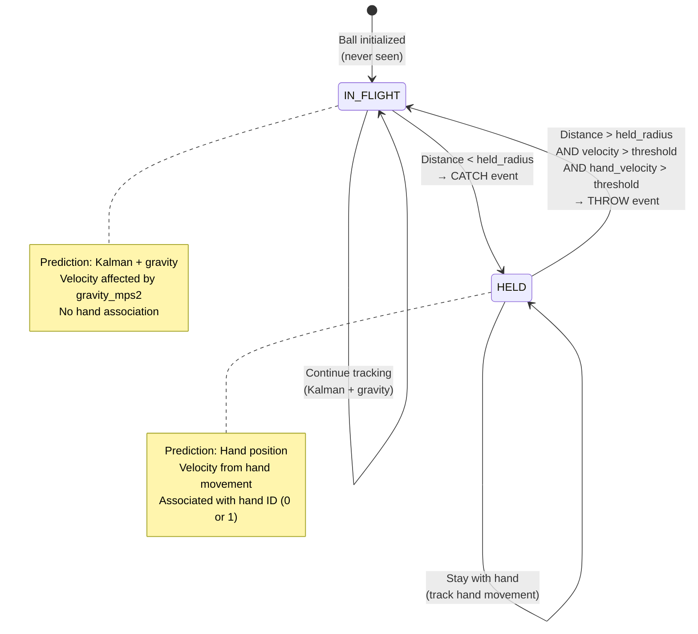

# New 3D Kalman Tracking System - Complete Documentation

**Last Updated:** 2025-10-21T09:46:00Z

**Recent Changes:**
- **2025-10-21**: Fixed bug - Hands can now hold multiple balls simultaneously (removed hand availability restriction)

## Table of Contents
1. [System Overview](#system-overview)
2. [Architecture Diagram](#architecture-diagram)
3. [Core Components](#core-components)
4. [Tracking Pipeline](#tracking-pipeline)
5. [State Machine](#state-machine)
6. [UI Settings](#ui-settings)
7. [Kalman Filter Configuration](#kalman-filter-configuration)
8. [Persistent Ball Architecture](#persistent-ball-architecture)
9. [Color Tracking System](#color-tracking-system)
10. [Event Generation](#event-generation)

---

## System Overview

The New 3D Kalman Tracking System is a physics-based ball tracking system that uses:
- **6-state Kalman filters** for position and velocity estimation
- **Persistent ball architecture** where balls are never deleted
- **Color-based ball identification** for multi-ball tracking
- **State machine logic** for HELD/IN_FLIGHT transitions
- **YOLO-based detection** for balls and pose estimation for hands
- **Gravity-aware prediction** for realistic trajectory modeling

### Key Features
- One persistent ball per enabled color profile
- Physics-based trajectory prediction with gravity
- Throw/catch detection with configurable thresholds
- Hand velocity-based throw enhancement
- Color-aware detection association
- Re-acquisition of lost balls by color matching

---

## Architecture Diagram



---

## Core Components

### 1. New3DBall Structure
Each tracked ball contains:

```cpp
struct New3DBall {
    // Identity
    long long id;                    // Unique permanent ID
    std::string color_name;          // "red", "green", "blue", etc.
    ColorProfile color_profile;      // HSV ranges for matching
    
    // State
    BallState state;                 // HELD or IN_FLIGHT
    int associated_hand_id;          // -1=none, 0=left, 1=right
    
    // Physics (Kalman Filter)
    cv::KalmanFilter kf;             // 6-state [x,y,z,vx,vy,vz]
    cv::Point3f last_known_position; // Official position
    cv::Point3f predicted_position;  // Kalman prediction
    
    // Tracking Quality
    int frames_since_seen;           // Counter (never triggers deletion)
    int consecutive_frames_seen;     // For confirmation
    bool color_locked;               // True after min_frames_for_color_lock
    
    // Visualization
    cv::Point2f pixel_pos;           // 2D screen position
    cv::Rect_<float> bbox;           // Bounding box
    float yolo_confidence;           // Detection confidence
    float color_match_score;         // Color matching score
    std::string tracking_reason;     // Debug info
    
    // History (for pattern analysis)
    std::vector<cv::Point3f> position_history;
    std::vector<uint64_t> timestamp_history;
};
```

### 2. Kalman Filter Configuration

**State Vector (6 dimensions):**
- `[x, y, z, vx, vy, vz]`
- Position in meters (camera coordinate system)
- Velocity in meters/second

**Transition Matrix (Constant Velocity Model):**
```
x_new = x + vx*dt
y_new = y + vy*dt
z_new = z + vz*dt
vx_new = vx + gravity_x*dt
vy_new = vy + gravity_y*dt
vz_new = vz + gravity_z*dt
```

**Measurement Matrix:**
- Measures position only (x, y, z)
- Velocity is estimated from position changes

**Noise Covariances:**
- Process noise: `1e-2` (model uncertainty)
- Measurement noise: `1e-1` (sensor uncertainty)
- Error covariance: `1.0` (initial uncertainty)

### 3. Detection Structure

```cpp
struct Detection {
    cv::Rect_<float> box;      // Bounding box in pixels
    cv::Point3f world_pos;     // 3D position in meters
    float confidence;          // YOLO confidence [0-1]
    int class_id;              // 0=ball, 1=ball_held
};
```

### 4. Hand Structure

```cpp
struct SimpleHand {
    cv::Point3f wrist_pos_3d;  // 3D wrist position
    float confidence;          // Keypoint confidence
    int id;                    // 0=left, 1=right
    bool is_visible;           // Detected this frame
};
```

---

## Tracking Pipeline

### Step 1: PREDICTION
**Purpose:** Predict where each ball should be this frame

**For HELD balls:**
1. Find associated hand
2. Set predicted position = hand wrist position
3. Update Kalman filter with hand position
4. Extract velocity for potential throw detection

**For IN_FLIGHT balls:**
1. Update transition matrix with dt
2. Apply gravity to velocity states: `v_new = v_old + g*dt`
3. Run Kalman prediction
4. Store predicted 3D position

### Step 2: ASSOCIATION
**Purpose:** Match YOLO detections to tracked balls

**Cost Calculation:**
```
total_cost = distance_cost + color_penalty

distance_cost = sqrt((pred_x - det_x)² + (pred_y - det_y)² + (pred_z - det_z)²)

color_penalty = {
    0.0m if colors match OR color not locked
    1.0m if colors don't match AND color locked
}
```

**Algorithm:** Greedy nearest-neighbor
1. Find ball-detection pair with minimum total_cost
2. If cost < max_distance (0.5m), create match
3. Mark both as matched
4. Repeat until no valid matches remain

**Output:**
- `matched_pairs`: Valid ball-detection associations
- `unmatched_balls`: Balls without detections
- `unmatched_detections`: Detections without balls

### Step 3: UPDATE MATCHED
**Purpose:** Update matched balls with new measurements

**For each matched pair:**
1. Reset `frames_since_seen = 0`
2. Increment `consecutive_frames_seen`
3. Update visualization data (bbox, confidence, pixel_pos)
4. Correct Kalman filter with detection measurement
5. Call state-specific handler:

**HELD State Handler:**
- Calculate ball velocity from Kalman state
- Find associated hand
- Calculate distance to hand
- Calculate hand velocity from previous frame
- Calculate relative velocity (ball - hand)
- **Check throw conditions:**
  - Distance > `held_radius_m` (0.12m)
  - Relative speed > `throw_velocity_threshold_mps` (0.5 m/s)
  - Hand speed > `hand_velocity_threshold` (1.0 m/s) if enabled
- If throw detected:
  - Transition to IN_FLIGHT
  - Clear hand association
  - Generate THROW event
- **Check hand-off:**
  - If distance > held_radius to current hand
  - Check distance to other hand
  - If < held_radius, transfer association (hands can hold multiple balls)

**IN_FLIGHT State Handler:**
- Correct Kalman filter with detection
- **Check catch conditions for each hand:**
  - Distance < `held_radius_m` (0.12m)
  - Hand is available (not holding another ball)
- If catch detected:
  - Transition to HELD
  - Set hand association
  - Generate CATCH event

### Step 4: RE-ACQUISITION
**Purpose:** Match unmatched detections to lost balls by color

**Algorithm:**
1. For each unmatched detection:
   - Calculate color match score with each unmatched ball's profile
   - Use GPU-accelerated HSV conversion if available
   - Score based on euclidean distance in hue-saturation space
2. Find best detection-ball pair with score > `color_match_threshold` (0.5)
3. Re-acquire ball:
   - Reset `frames_since_seen = 0`
   - Update Kalman filter with detection
   - Determine state (HELD/IN_FLIGHT) based on hand proximity
   - Update visualization data

### Step 5: HANDLE UNMATCHED
**Purpose:** Track balls that weren't detected this frame

**For each unmatched ball:**
1. Increment `frames_since_seen`
2. Reset `consecutive_frames_seen = 0`
3. Update tracking_reason with unseen count
4. **NOTE:** Ball is NEVER deleted (persistent architecture)

### Step 6: FINALIZE
**Purpose:** Update final positions and prepare for next frame

**For each ball:**
1. **Update final position:**
   - HELD: Use hand position if available, else predicted position
   - IN_FLIGHT: Use Kalman predicted position
2. **Lock color** if `consecutive_frames_seen >= min_frames_for_color_lock` (5)
3. **Update history:**
   - Append position to `position_history`
   - Append timestamp to `timestamp_history`
   - Keep last 100 positions only
4. Store current hand positions for next frame velocity calculation

---

## State Machine



### State Transition Conditions

**IN_FLIGHT → HELD (Catch):**
- Ball distance to hand < `held_radius_m` (0.12m)
- Hand is available (not holding another ball)
- Generates CATCH event with ball_id, hand_id, timestamp

**HELD → IN_FLIGHT (Throw):**
- Ball distance to hand > `held_radius_m` (0.12m)
- Relative velocity > `throw_velocity_threshold_mps` (0.5 m/s)
- Hand velocity > `hand_velocity_threshold` (1.0 m/s) if enabled
- Generates THROW event with ball_id, hand_id, timestamp

**HELD → HELD (Hand-off):**
- Ball distance to current hand > `held_radius_m`
- Ball distance to other hand < `held_radius_m`
- Other hand is available
- No event generated (internal state change)

---

## UI Settings

### Camera Settings
| Setting | Type | Default | Description |
|---------|------|---------|-------------|
| `resolution` | [int, int] | [1280, 720] | Camera resolution |
| `fps` | int | 30 | Frames per second |
| `depth_sensor_enabled` | bool | true | Enable depth sensor |

### YOLO Detection Settings
| Setting | Type | Default | Description |
|---------|------|---------|-------------|
| `enable_ball_detection` | bool | true | Enable ball detection |
| `ball_confidence_threshold` | float | 0.25 | Min confidence for 'ball' class |
| `ball_held_confidence_threshold` | float | 0.25 | Min confidence for 'ball_held' class |
| `nms_threshold` | float | 0.5 | Non-maximum suppression threshold |
| `ignore_class` | bool | false | Treat ball/ball_held as same class |

### Pose Estimation Settings
| Setting | Type | Default | Description |
|---------|------|---------|-------------|
| `pose_model_enabled` | bool | true | Enable pose estimation |

### Geometry & Distance Settings
| Setting | Type | Default | Description |
|---------|------|---------|-------------|
| `held_radius_m` | float | 0.12 | Radius for held detection (meters) |
| `association_max_distance_m` | float | 0.5 | Max distance for detection matching (meters) |
| `color_mismatch_penalty_m` | float | 1.0 | Distance penalty for color mismatch (meters) |

### Physics Settings
| Setting | Type | Default | Description |
|---------|------|---------|-------------|
| `throw_velocity_threshold_mps` | float | 0.5 | Min relative velocity for throw (m/s) |
| `gravity_x` | float | 0.0 | Gravity X component (m/s²) |
| `gravity_y` | float | -9.81 | Gravity Y component (m/s²) |
| `gravity_z` | float | 0.0 | Gravity Z component (m/s²) |

### Tracking Logic Settings
| Setting | Type | Default | Description |
|---------|------|---------|-------------|
| `max_frames_unseen` | int | 30 | **DEPRECATED** - Balls never deleted |
| `min_frames_for_new_track` | int | 3 | Frames to confirm new track |
| `min_frames_for_color_lock` | int | 5 | Frames to lock color identity |

### Color Tracking Settings
| Setting | Type | Default | Description |
|---------|------|---------|-------------|
| `use_color_tracking` | bool | true | Enable color-based identification |
| `color_match_threshold` | float | 0.5 | Min color match score [0-1] |
| `color_sample_radius` | int | 1 | Pixel radius for color sampling |

### Hand Velocity Settings
| Setting | Type | Default | Description |
|---------|------|---------|-------------|
| `hand_velocity_enabled` | bool | true | Enable velocity-based throw detection |
| `hand_velocity_threshold` | float | 1.0 | Min hand speed for enhanced detection (m/s) |

### Visualization Settings
| Setting | Type | Default | Description |
|---------|------|---------|-------------|
| `show_kalman_prediction` | bool | true | Show predicted position (magenta circle) |
| `show_held_radius` | bool | true | Show held detection radius around hands |
| `show_association_lines` | bool | true | Show detection-to-track associations |

### Event Settings
| Setting | Type | Default | Description |
|---------|------|---------|-------------|
| `tc_sound_on_catch` | bool | false | Play sound on catch event |
| `tc_sound_on_throw` | bool | false | Play sound on throw event |
| `tc_name_on_catch` | bool | false | Display name on catch event |
| `tc_name_on_throw` | bool | false | Display name on throw event |

### Color Profiles
Each color profile contains:
- `name`: Color name (pink, orange, yellow, green, red, blue, purple, white)
- `enabled`: Whether this color is tracked
- `avg_hue`: Calibrated average hue value (-1 if not calibrated)
- `avg_saturation`: Calibrated average saturation (-1 if not calibrated)
- `min_hsv`: Minimum HSV values [H, S, V]
- `max_hsv`: Maximum HSV values [H, S, V]
- `min_hsv2`: Secondary range for wrap-around colors
- `max_hsv2`: Secondary range maximum

**Current Configuration:**
- **pink**: ENABLED
- **orange**: DISABLED
- **yellow**: DISABLED
- **green**: DISABLED
- **red**: DISABLED
- **blue**: DISABLED
- **purple**: DISABLED
- **white**: DISABLED

---

## Kalman Filter Configuration

### State Vector (6D)
```
State = [x, y, z, vx, vy, vz]ᵀ

Where:
- x, y, z: Position in meters (camera coordinate system)
- vx, vy, vz: Velocity in meters/second
```

### Transition Matrix (Constant Velocity + Gravity)
```
F = [1  0  0  dt 0  0 ]
    [0  1  0  0  dt 0 ]
    [0  0  1  0  0  dt]
    [0  0  0  1  0  0 ]
    [0  0  0  0  1  0 ]
    [0  0  0  0  0  1 ]

Where dt is the time delta between frames
```

### Measurement Matrix
```
H = [1  0  0  0  0  0]
    [0  1  0  0  0  0]
    [0  0  1  0  0  0]

Measures position only (x, y, z)
Velocity is estimated from position changes
```

### Gravity Application
For IN_FLIGHT balls, gravity is applied before prediction:
```cpp
ball.kf.statePost.at<float>(3) += gravity_x * dt;  // vx
ball.kf.statePost.at<float>(4) += gravity_y * dt;  // vy (typically -9.81)
ball.kf.statePost.at<float>(5) += gravity_z * dt;  // vz
```

### Noise Covariances
```
Process Noise (Q): 1e-2 * I₆
- Represents uncertainty in the motion model
- Lower values = trust model more

Measurement Noise (R): 1e-1 * I₃
- Represents uncertainty in measurements
- Lower values = trust measurements more

Initial Error Covariance (P): 1.0 * I₆
- Initial uncertainty in state estimate
```

---

## Persistent Ball Architecture

### Key Concept
**Balls are NEVER deleted.** Each enabled color profile gets exactly one permanent ball that persists for the entire tracking session.

### Initialization
```cpp
void initializePersistentBalls() {
    for (const auto& profile : color_profiles_) {
        if (!profile.enabled) continue;
        
        New3DBall ball;
        ball.id = next_track_id_++;
        ball.color_name = profile.name;
        ball.color_profile = profile;
        ball.state = IN_FLIGHT;
        ball.frames_since_seen = 999999;  // "Never seen"
        ball.color_locked = true;         // Color known from start
        
        tracked_balls_.push_back(ball);
    }
}
```

### Re-Acquisition Logic
When a ball is lost (no detection match):
1. `frames_since_seen` increments each frame
2. Ball remains in `tracked_balls_` vector
3. When unmatched detection appears:
   - Calculate color match score with all lost balls
   - If score > threshold, re-acquire the ball
   - Reset `frames_since_seen = 0`
   - Update Kalman filter with new position
   - Determine state based on hand proximity

### Benefits
- No ID switching between balls of same color
- Consistent ball tracking across occlusions
- Simplified state management
- Better for juggling pattern analysis

### Color Profile Management
When color profiles are updated via UI:
```cpp
void reloadColorProfiles() {
    loadSettings();                    // Reload from JSON
    tracked_balls_.clear();            // Clear existing balls
    active_track_colors_.clear();
    initializePersistentBalls();       // Recreate with new enabled states
}
```

---

## Color Tracking System

### Color Matching Algorithm

**Method 1: Calibrated (Euclidean Distance)**
When `avg_hue` and `avg_saturation` are calibrated (≥ 0):
```cpp
float hue_diff = (detected_hue / 180.0) - (profile_hue / 180.0);
float sat_diff = (detected_sat / 255.0) - (profile_sat / 255.0);

// Handle hue wrap-around
if (hue_diff > 0.5) hue_diff -= 1.0;
if (hue_diff < -0.5) hue_diff += 1.0;

float euclidean_dist = sqrt(hue_diff² + sat_diff²);
float score = exp(-euclidean_dist * 10.0);  // [0-1]
```

**Method 2: Range-Based (Legacy)**
When not calibrated, uses HSV range matching:
```cpp
bool matches = (H >= min_H && H <= max_H &&
                S >= min_S && S <= max_S &&
                V >= min_V && V <= max_V);

// Check secondary range for wrap-around colors (e.g., red)
if (!matches && min_H2 >= 0) {
    matches = (H >= min_H2 && H <= max_H2 && ...);
}

score = match_count / total_pixels;  // [0-1]
```

### Color Sampling
- Samples pixels in radius around detection center
- Default radius: 1 pixel (3x3 grid)
- Uses GPU-accelerated HSV conversion if available
- Falls back to CPU conversion otherwise

### Color-Aware Association
During detection-to-ball matching:
```cpp
total_cost = distance_cost + color_penalty

color_penalty = {
    0.0m if colors match OR color not locked
    1.0m if colors don't match AND color locked
}
```

This prevents balls from switching identities when they cross paths.

---

## Event Generation

### Event Types
```cpp
enum EventType {
    THROW,  // Ball leaves hand
    CATCH   // Ball enters hand
};

struct BallEvent {
    EventType type;
    int ball_id;
    int hand_id;
    uint64_t timestamp;  // Milliseconds since epoch
};
```

### THROW Event
**Generated when:**
- Ball in HELD state
- Distance to hand > `held_radius_m`
- Relative velocity > `throw_velocity_threshold_mps`
- Hand velocity > `hand_velocity_threshold` (if enabled)

**Contains:**
- `ball_id`: ID of thrown ball
- `hand_id`: ID of hand that threw (0=left, 1=right)
- `timestamp`: Time of throw detection

### CATCH Event
**Generated when:**
- Ball in IN_FLIGHT state
- Distance to hand < `held_radius_m`
- Hand is available (not holding another ball)

**Contains:**
- `ball_id`: ID of caught ball
- `hand_id`: ID of hand that caught (0=left, 1=right)
- `timestamp`: Time of catch detection

### Event Handling
Events are returned from `updateNew3D()` and can trigger:
- Sound effects (if `tc_sound_on_throw`/`tc_sound_on_catch` enabled)
- Visual notifications (if `tc_name_on_throw`/`tc_name_on_catch` enabled)
- Pattern analysis (for siteswap detection)
- Performance metrics (throw height, catch timing, etc.)

---

## Performance Characteristics

### Computational Complexity
- **Prediction:** O(n) where n = number of balls
- **Association:** O(n*m) where m = number of detections
- **Update:** O(k) where k = number of matches
- **Re-acquisition:** O(u*d) where u = unmatched balls, d = unmatched detections

### Typical Frame Processing
1. YOLO ball detection: ~10-20ms (GPU)
2. YOLO pose estimation: ~10-20ms (GPU)
3. Kalman prediction: <1ms
4. Association: <1ms
5. State updates: <1ms
6. Visualization: ~2-5ms

**Total:** ~25-45ms per frame (22-40 FPS)

### Memory Usage
- Each ball: ~500 bytes (including Kalman matrices)
- Typical configuration (1 ball): ~500 bytes
- Maximum configuration (8 balls): ~4 KB
- Position history (100 positions per ball): ~2.4 KB per ball

---

## Coordinate Systems

### Camera Coordinate System
```
       Y (up)
       |
       |
       |_______ X (right)
      /
     /
    Z (forward, into scene)
```

### Depth Frame
- 16-bit unsigned integers
- Values in millimeters
- Converted to meters: `depth_m = depth_mm / 1000.0`

### Projection/Deprojection
```cpp
// 2D pixel + depth → 3D world
x_3d = (pixel_x - ppx) * depth / fx
y_3d = (pixel_y - ppy) * depth / fy
z_3d = depth

// 3D world → 2D pixel
pixel_x = (x_3d * fx) / z_3d + ppx
pixel_y = (y_3d * fy) / z_3d + ppy
```

---

## Troubleshooting Guide

### Ball Not Detected
1. Check YOLO confidence thresholds
2. Verify color profile is enabled
3. Check lighting conditions
4. Verify depth sensor is working

### False Throw Detection
1. Increase `throw_velocity_threshold_mps`
2. Enable `hand_velocity_enabled`
3. Increase `hand_velocity_threshold`
4. Increase `held_radius_m`

### False Catch Detection
1. Decrease `held_radius_m`
2. Check hand detection quality
3. Verify depth accuracy

### Ball ID Switching
1. Verify color profiles are distinct
2. Increase `color_mismatch_penalty_m`
3. Check `color_match_threshold`
4. Ensure balls are different colors

### Lost Ball Not Re-acquired
1. Check `color_match_threshold` (lower = more lenient)
2. Verify color profile calibration
3. Check lighting consistency
4. Increase `color_sample_radius`

---

## Future Enhancements

### Planned Features
1. **Siteswap Detection:** Use position history for pattern recognition
2. **Multi-Person Support:** Track multiple jugglers simultaneously
3. **Trajectory Visualization:** Show predicted flight paths
4. **Performance Metrics:** Throw height, dwell time, pattern stability
5. **Adaptive Thresholds:** Auto-tune based on juggling style
6. **Occlusion Handling:** Better prediction during hand occlusions

### Experimental Features
1. **IMU Integration:** Use ball-mounted IMUs for enhanced tracking
2. **Multi-Camera Fusion:** Combine multiple camera views
3. **Machine Learning Prediction:** Learn juggler-specific patterns
4. **Real-time Coaching:** Provide feedback on technique

---

## References

### Related Documentation
- [`NEW_3D_TRACKER_ARCHITECTURE.md`](NEW_3D_TRACKER_ARCHITECTURE.md) - Original architecture design
- [`NEW_3D_TRACKER_IMPLEMENTATION_COMPLETE.md`](NEW_3D_TRACKER_IMPLEMENTATION_COMPLETE.md) - Implementation details
- [`PERSISTENT_BALL_ARCHITECTURE_IMPLEMENTATION.md`](PERSISTENT_BALL_ARCHITECTURE_IMPLEMENTATION.md) - Persistent ball system
- [`TRACKING_SYSTEM_SETTINGS_USER_GUIDE.md`](TRACKING_SYSTEM_SETTINGS_USER_GUIDE.md) - UI settings guide

### Source Files
- [`engine/include/New3DTracker.hpp`](engine/include/New3DTracker.hpp:1) - Header file
- [`engine/src/New3DTracker.cpp`](engine/src/