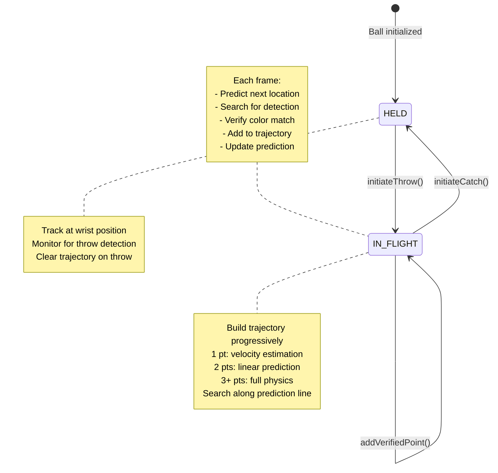

# Trajectory-Based Ball Tracking Architecture Design

**Version:** 1.0  
**Date:** 2025-10-10  
**Status:** Design Phase  

---

## Table of Contents

1. [Executive Summary](#executive-summary)
2. [System Overview](#system-overview)
3. [Data Structures](#data-structures)
4. [Algorithm Flow](#algorithm-flow)
5. [State Transition Logic](#state-transition-logic)
6. [Visualization System](#visualization-system)
7. [Settings Architecture](#settings-architecture)
8. [Implementation Roadmap](#implementation-roadmap)
9. [Performance Considerations](#performance-considerations)

---

## Executive Summary

This document specifies the architecture for a cleaner, physics-based trajectory tracking system that replaces the current Kalman filter approach. The system uses two states (HELD and IN_FLIGHT) with intelligent trajectory building that adapts based on the number of verified points collected.

**Key Features:**
- Simple two-state machine (HELD → IN_FLIGHT → HELD)
- Progressive trajectory building (1 point → 2 points → 3+ points)
- GPU-accelerated physics predictions using existing [`GpuTrajectoryPredictor`](engine/include/GpuTrajectoryPredictor.hpp)
- Adaptive search radius based on confidence
- Real-time visualization with trajectory prediction lines

---

## System Overview

### Current System Context

The system already has:
- [`SimpleBall`](engine/include/SimpleBallTracker.hpp:89-126) struct with `BallState` enum (HELD, IN_FLIGHT)
- [`BallTrajectory`](engine/include/GpuTrajectoryPredictor.hpp:41-67) struct with points list and physics parameters
- [`GpuTrajectoryPredictor`](engine/include/GpuTrajectoryPredictor.hpp:86-249) for GPU-accelerated physics calculations
- [`updateInFlightBall()`](engine/src/SimpleBallTracker.cpp:1488) and [`updateHeldBall()`](engine/src/SimpleBallTracker.cpp:1914) methods
- [`initiateThrow()`](engine/src/SimpleBallTracker.cpp:1741) and [`initiateCatch()`](engine/src/SimpleBallTracker.cpp:1785) for state transitions

### Architecture Diagram



---

## Data Structures

### 1. Enhanced BallTrajectory (Already Exists)

**Location:** [`engine/include/GpuTrajectoryPredictor.hpp:41-67`](engine/include/GpuTrajectoryPredictor.hpp:41-67)

**Current Structure:**
```cpp
struct BallTrajectory {
    std::vector<TrajectoryPoint> points;           // Verified points
    cv::Point3f initial_velocity;                  // v0 (m/s)
    cv::Point3f initial_position;                  // p0 (m)
    float gravity;                                 // g (m/s²)
    uint64_t throw_timestamp;                      // Start time
    int verified_point_count;                      // Confirmed points
    float trajectory_confidence;                   // 0.0-1.0
    float search_radius_m;                         // Current search radius
    std::vector<cv::Point3f> predicted_path;       // Full prediction
    uint64_t prediction_timestamp;                 // When computed
    bool prediction_valid;                         // Up-to-date flag
};
```

**No Changes Required** - This structure already contains everything needed.

### 2. Enhanced TrackingSettings

**Location:** [`engine/include/SimpleBallTracker.hpp:138-199`](engine/include/SimpleBallTracker.hpp:138-199)

**Additions Required:**
```cpp
struct TrackingSettings {
    // === NEW: Trajectory Settings Section ===
    
    // Physics parameters
    float gravity = 9.81f;                        // Gravitational acceleration (m/s²)
    float trajectory_time_step = 0.033f;          // Time between predicted points (s) - 30fps
    float max_trajectory_duration = 3.0f;         // Maximum trajectory duration (s)
    
    // Search parameters
    float trajectory_search_radius = 0.30f;       // Search radius along trajectory (m)
    float trajectory_min_search_radius = 0.10f;   // Minimum search radius when confident (m)
    float trajectory_color_threshold = 0.50f;     // Color match threshold for verification (0.0-1.0)
    
    // Confidence parameters
    int trajectory_min_points_full_prediction = 3; // Points needed before using full physics
    int trajectory_points_full_confidence = 5;     // Points needed for 100% confidence
    
    // Velocity estimation parameters
    float trajectory_initial_velocity_scale = 1.0f; // Scale factor for initial velocity estimation
    float trajectory_max_velocity = 15.0f;          // Maximum reasonable velocity (m/s)
    
    // === EXISTING SETTINGS (keep for backward compatibility) ===
    float throw_distance_threshold = 0.20f;
    float catch_distance_threshold = 0.30f;
    int min_frames_for_transition = 2;
    // ... rest of existing settings ...
};
```

### 3. Enhanced TrajectoryVisualizationSettings

**Location:** [`engine/include/SimpleBallTracker.hpp:201-220`](engine/include/SimpleBallTracker.hpp:201-220)

**Additions Required:**
```cpp
struct TrajectoryVisualizationSettings {
    // === EXISTING ===
    bool show_trajectory = true;
    bool show_verified_points = true;
    bool show_predicted_path = true;
    bool show_search_radius = true;
    bool show_confidence = true;
    
    // === NEW: Text Annotations ===
    bool show_trajectory_text = false;            // Show trajectory points as text
    bool show_velocity_vector = true;             // Show initial velocity arrow
    bool show_point_timestamps = false;           // Show timestamp for each point
    
    // === NEW: Recording-specific ===
    bool recording_show_all_points = true;        // List all points in recording images
    bool recording_show_physics_params = true;    // Show v0, gravity in recording
    
    // Colors (BGR)
    cv::Scalar trajectory_color = cv::Scalar(255, 255, 0);      // Cyan
    cv::Scalar verified_point_color = cv::Scalar(0, 255, 0);    // Green
    cv::Scalar predicted_point_color = cv::Scalar(0, 255, 255); // Yellow
    cv::Scalar search_radius_color = cv::Scalar(255, 0, 255);   // Magenta
    cv::Scalar velocity_vector_color = cv::Scalar(0, 165, 255); // Orange
    
    // Sizes
    int trajectory_thickness = 2;
    int point_radius = 5;
    float trajectory_point_spacing = 0.05f;       // 5cm between drawn points
    int velocity_arrow_length = 100;              // pixels
};
```

### 4. TrajectoryPoint (Already Exists)

**Location:** [`engine/include/GpuTrajectoryPredictor.hpp:28-39`](engine/include/GpuTrajectoryPredictor.hpp:28-39)

**No Changes Required** - Already has position, timestamp, confidence, and verified flag.

---

## Algorithm Flow

### Main Update Loop

```cpp
// In SimpleBallTracker::update()
for (auto& ball : balls_) {
    if (ball.state == HELD) {
        updateHeldBall(ball, hands, yolo_detections, color_frame, depth_frame, intrinsics, events);
    } else {  // IN_FLIGHT
        updateInFlightBall(ball, yolo_detections, color_frame, depth_frame, intrinsics, events);
    }
}
```

### 1. HELD State Logic (updateHeldBall)

**Current Implementation:** [`engine/src/SimpleBallTracker.cpp:1914`](engine/src/SimpleBallTracker.cpp:1914)

**Enhanced Flow:**
```
1. Track ball at wrist position of holding hand
2. Search for YOLO detections near wrist
3. If detection found far from wrist (> throw_distance_threshold):
   a. Call initiateThrow()
   b. Transition to IN_FLIGHT
4. Update ball position to wrist location
```

**No Major Changes Required** - Current implementation already handles this correctly.

### 2. IN_FLIGHT State Logic (updateInFlightBall)

**Current Implementation:** [`engine/src/SimpleBallTracker.cpp:1488`](engine/src/SimpleBallTracker.cpp:1488)

**Enhanced Flow:**

```
FUNCTION updateInFlightBall(ball, yolo_detections, color_frame, depth_frame, intrinsics, events):
    
    // Step 1: Determine prediction strategy based on point count
    point_count = ball.trajectory.verified_point_count
    
    IF point_count == 0:
        // Should not happen - throw should add first point
        RETURN
    
    ELSE IF point_count == 1:
        // Use last held position + first flight position for velocity estimation
        predicted_next = predictWithOnePoint(ball)
    
    ELSE IF point_count == 2:
        // Use two points for linear prediction
        predicted_next = predictWithTwoPoints(ball)
    
    ELSE:  // point_count >= 3
        // Use full physics-based trajectory
        predicted_path = predictFullTrajectory(ball)
        predicted_next = getNextPointOnPath(predicted_path)
    
    // Step 2: Search for detection along prediction line
    detection = searchAlongPredictionLine(
        predicted_next,
        ball.trajectory.search_radius_m,
        yolo_detections,
        color_frame,
        depth_frame,
        intrinsics,
        ball.color_name
    )
    
    // Step 3: Handle detection result
    IF detection found:
        // Verify color match
        color_score = matchColor(detection, ball.color_profile, color_frame)
        
        IF color_score >= trajectory_color_threshold:
            // Add verified point
            addVerifiedPoint(ball, detection.world_pos, current_timestamp)
            
            // Update prediction for next frame
            IF point_count >= 2:
                refineTrajectory(ball)
            
            // Update confidence and search radius
            updateConfidence(ball)
            
            // Check for catch
            IF nearAnyHand(detection.world_pos, hands, catch_distance_threshold):
                closest_hand = findClosestHand(detection.world_pos, hands)
                initiateCatch(ball, closest_hand, events)
                RETURN
        ELSE:
            // Color mismatch - keep searching with fallback
            fallbackColorBlobSearch(ball, color_frame, depth_frame, intrinsics)
    
    ELSE:
        // No YOLO detection - use color blob fallback
        fallbackColorBlobSearch(ball, color_frame, depth_frame, intrinsics)
```

### 3. Prediction Strategies

#### Strategy A: One Point (Initial Throw)

```cpp
cv::Point3f predictWithOnePoint(SimpleBall& ball) {
    // Use last held position (stored in trajectory.initial_position)
    // and first flight position to estimate velocity
    
    const TrajectoryPoint& first_point = ball.trajectory.points[0];
    cv::Point3f last_held_pos = ball.trajectory.initial_position;
    
    // Estimate time between held and first detection
    float dt = 0.033f;  // Assume one frame (30fps)
    
    // Estimate velocity: v = (p1 - p0) / dt
    cv::Point3f estimated_velocity = (first_point.position - last_held_pos) / dt;
    
    // Scale velocity if needed
    estimated_velocity *= tracking_settings_.trajectory_initial_velocity_scale;
    
    // Clamp to reasonable values
    float speed = cv::norm(estimated_velocity);
    if (speed > tracking_settings_.trajectory_max_velocity) {
        estimated_velocity *= (tracking_settings_.trajectory_max_velocity / speed);
    }
    
    // Store for future use
    ball.trajectory.initial_velocity = estimated_velocity;
    
    // Predict next position using simple ballistic motion
    cv::Point3f predicted = first_point.position + estimated_velocity * dt;
    predicted.z -= 0.5f * tracking_settings_.gravity * dt * dt;
    
    return predicted;
}
```

#### Strategy B: Two Points (Linear Prediction)

```cpp
cv::Point3f predictWithTwoPoints(SimpleBall& ball) {
    // Use last two verified points for linear extrapolation
    
    const TrajectoryPoint& p1 = ball.trajectory.points[ball.trajectory.points.size() - 2];
    const TrajectoryPoint& p2 = ball.trajectory.points[ball.trajectory.points.size() - 1];
    
    // Calculate time difference
    float dt = (p2.timestamp - p1.timestamp) / 1000000.0f;  // Convert µs to s
    
    // Estimate velocity from these two points
    cv::Point3f velocity = (p2.position - p1.position) / dt;
    
    // Update stored velocity
    ball.trajectory.initial_velocity = velocity;
    
    // Predict next position (one frame ahead)
    float predict_dt = tracking_settings_.trajectory_time_step;
    cv::Point3f predicted = p2.position + velocity * predict_dt;
    predicted.z -= 0.5f * tracking_settings_.gravity * predict_dt * predict_dt;
    
    return predicted;
}
```

#### Strategy C: Full Physics (3+ Points)

```cpp
std::vector<cv::Point3f> predictFullTrajectory(SimpleBall& ball) {
    // Use GPU-accelerated trajectory predictor
    
    // Re-estimate initial velocity from all verified points
    cv::Point3f refined_velocity = gpu_trajectory_predictor_->estimateInitialVelocity(
        ball.trajectory.points,
        tracking_settings_.gravity
    );
    
    // Update trajectory parameters
    ball.trajectory.initial_velocity = refined_velocity;
    
    // Predict full trajectory path
    TrajectoryPredictionParams params;
    params.time_step = tracking_settings_.trajectory_time_step;
    params.max_time = tracking_settings_.max_trajectory_duration;
    params.gravity = tracking_settings_.gravity;
    
    std::vector<cv::Point3f> predicted_path = gpu_trajectory_predictor_->predictTrajectory(
        ball.trajectory.initial_position,
        refined_velocity,
        params
    );
    
    // Cache prediction
    ball.trajectory.predicted_path = predicted_path;
    ball.trajectory.prediction_timestamp = getCurrentTimestamp();
    ball.trajectory.prediction_valid = true;
    
    return predicted_path;
}
```

### 4. Search Along Prediction Line

```cpp
Detection* searchAlongPredictionLine(
    const cv::Point3f& predicted_pos,
    float search_radius,
    const std::vector<Detection>& yolo_detections,
    const cv::Mat& color_frame,
    const cv::Mat& depth_frame,
    const CameraIntrinsics& intrinsics,
    const std::string& ball_color
) {
    Detection* best_detection = nullptr;
    float best_distance = search_radius;
    float best_color_score = 0.0f;
    
    // Search through all YOLO detections
    for (auto& det : yolo_detections) {
        // Calculate 3D distance to predicted position
        float distance = cv::norm(det.world_pos - predicted_pos);
        
        if (distance < search_radius) {
            // Within search radius - check color match
            float color_score = matchColor(det, getColorProfile(ball_color), color_frame);
            
            // Prefer closer detections with better color match
            float combined_score = color_score - (distance / search_radius) * 0.3f;
            
            if (combined_score > best_color_score) {
                best_detection = &det;
                best_distance = distance;
                best_color_score = color_score;
            }
        }
    }
    
    return best_detection;
}
```

### 5. Fallback Color Blob Search

```cpp
void fallbackColorBlobSearch(
    SimpleBall& ball,
    const cv::Mat& color_frame,
    const cv::Mat& depth_frame,
    const CameraIntrinsics& intrinsics
) {
    // Project predicted position to 2D
    cv::Point2f predicted_2d = project_3d_to_2d(
        ball.trajectory.predicted_path.empty() ? 
            ball.position : 
            ball.trajectory.predicted_path[0],
        intrinsics
    );
    
    // Search for color blob in wider radius
    int search_radius_pixels = static_cast<int>(
        ball.trajectory.search_radius_m * intrinsics.fx
    );
    
    cv::Point2f blob_center = searchForColorBlob(
        color_frame,
        getColorProfile(ball.color_name),
        predicted_2d,
        search_radius_pixels
    );
    
    if (blob_center.x >= 0) {
        // Found color blob - get depth and add point
        float depth = getDepthAtPoint(depth_frame, blob_center);
        
        if (depth > MIN_DEPTH && depth < MAX_DEPTH) {
            cv::Point3f world_pos = deprojectToWorld(blob_center, depth, intrinsics);
            
            // Add with lower confidence since not YOLO-verified
            addVerifiedPoint(ball, world_pos, getCurrentTimestamp(), 0.7f);
        }
    }
}
```

---

## State Transition Logic

### 1. HELD → IN_FLIGHT (initiateThrow)

**Current Implementation:** [`engine/src/SimpleBallTracker.cpp:1741`](engine/src/SimpleBallTracker.cpp:1741)

**Enhanced Logic:**

```cpp
void SimpleBallTracker::initiateThrow(
    SimpleBall& ball,
    const Detection& first_detection,
    const SimpleHand* hand,
    std::vector<BallEvent>& events
) {
    // 1. Clear trajectory list
    ball.trajectory.points.clear();
    ball.trajectory.verified_point_count = 0;
    ball.trajectory.trajectory_confidence = 0.0f;
    ball.trajectory.prediction_valid = false;
    
    // 2. Store last held position as initial position
    if (hand != nullptr) {
        ball.trajectory.initial_position = hand->wrist_pos_3d;
    } else {
        ball.trajectory.initial_position = ball.position;
    }
    
    // 3. Add first flight position to trajectory
    TrajectoryPoint first_point(
        first_detection.world_pos,
        getCurrentTimestamp(),
        first_detection.confidence,
        true  // verified by YOLO
    );
    ball.trajectory.points.push_back(first_point);
    ball.trajectory.verified_point_count = 1;
    
    // 4. Store throw timestamp
    ball.trajectory.throw_timestamp = getCurrentTimestamp();
    
    // 5. Initialize search radius to maximum
    ball.trajectory.search_radius_m = tracking_settings_.trajectory_search_radius;
    
    // 6. Set gravity
    ball.trajectory.gravity = tracking_settings_.gravity;
    
    // 7. Estimate initial velocity (will be refined as more points come in)
    float dt = 0.033f;  // Assume one frame
    ball.trajectory.initial_velocity = 
        (first_detection.world_pos - ball.trajectory.initial_position) / dt;
    
    // 8. Update state
    ball.state = IN_FLIGHT;
    ball.is_held = false;
    ball.held_by_hand_id = -1;
    
    // 9. Generate THROW event
    BallEvent event;
    event.type = BallEvent::THROW;
    event.ball_id = ball.id;
    event.hand_id = hand ? hand->id : -1;
    event.timestamp = getCurrentTimestamp();
    events.push_back(event);
    
    // 10. Update tracking reason
    ball.tracking_reason = "THROW: Initiated trajectory tracking";
}
```

### 2. IN_FLIGHT → HELD (initiateCatch)

**Current Implementation:** [`engine/src/SimpleBallTracker.cpp:1785`](engine/src/SimpleBallTracker.cpp:1785)

**Enhanced Logic:**

```cpp
void SimpleBallTracker::initiateCatch(
    SimpleBall& ball,
    const SimpleHand& hand,
    std::vector<BallEvent>& events
) {
    // 1. Clear entire trajectory list
    ball.trajectory.points.clear();
    ball.trajectory.verified_point_count = 0;
    ball.trajectory.trajectory_confidence = 0.0f;
    ball.trajectory.prediction_valid = false;
    ball.trajectory.predicted_path.clear();
    
    // 2. Reset physics parameters
    ball.trajectory.initial_velocity = cv::Point3f(0, 0, 0);
    ball.trajectory.initial_position = cv::Point3f(0, 0, 0);
    
    // 3. Update state
    ball.state = HELD;
    ball.is_held = true;
    ball.held_by_hand_id = hand.id;
    
    // 4. Update position to wrist
    ball.position = hand.wrist_pos_3d;
    
    // 5. Generate CATCH event
    BallEvent event;
    event.type = BallEvent::CATCH;
    event.ball_id = ball.id;
    event.hand_id = hand.id;
    event.timestamp = getCurrentTimestamp();
    events.push_back(event);
    
    // 6. Update tracking reason
    ball.tracking_reason = "CATCH: Ball returned to hand";
}
```

### 3. Add Verified Point

```cpp
void SimpleBallTracker::addVerifiedPoint(
    SimpleBall& ball,
    const cv::Point3f& position,
    uint64_t timestamp,
    float confidence = 1.0f
) {
    // Create new trajectory point
    TrajectoryPoint point(position, timestamp, confidence, true);
    
    // Add to trajectory
    ball.trajectory.points.push_back(point);
    ball.trajectory.verified_point_count++;
    
    // Update ball position
    ball.position = position;
    
    // Invalidate cached prediction (will be recomputed next frame)
    ball.trajectory.prediction_valid = false;
    
    // Update confidence and search radius
    gpu_trajectory_predictor_->updateConfidence(
        ball.trajectory,
        tracking_settings_.trajectory_points_full_confidence,
        tracking_settings_.trajectory_min_search_radius,
        tracking_settings_.trajectory_search_radius
    );
}
```

---

## Visualization System

### 1. Real-Time Video Feed Visualization

**Method:** [`SimpleBallTracker::drawTrajectory()`](engine/include/SimpleBallTracker.hpp:268)

**Implementation:**

```cpp
void SimpleBallTracker::drawTrajectory(
    cv::Mat& frame,
    const SimpleBall& ball,
    const CameraIntrinsics& intrinsics
) const {
    if (!viz_settings_.show_trajectory || ball.state != IN_FLIGHT) {
        return;
    }
    
    // 1. Draw verified points
    if (viz_settings_.show_verified_points) {
        for (const auto& point : ball.trajectory.points) {
            cv::Point2f pixel = project_3d_to_2d(point.position, intrinsics);
            
            // Draw point with confidence-based color
            cv::Scalar color = viz_settings_.verified_point_color;
            if (point.confidence < 0.8f) {
                color = cv::Scalar(0, 255, 255);  // Yellow for lower confidence
            }
            
            cv::circle(frame, pixel, viz_settings_.point_radius, color, -1);
            
            // Optionally show timestamp
            if (viz_settings_.show_point_timestamps) {
                std::string time_text = std::to_string(point.timestamp / 1000) + "ms";
                cv::putText(frame, time_text, pixel + cv::Point2f(10, 0),
                           cv::FONT_HERSHEY_SIMPLEX, 0.3, color, 1);
            }
        }
    }
    
    // 2. Draw predicted path
    if (viz_settings_.show_predicted_path && ball.trajectory.prediction_valid) {
        std::vector<cv::Point2f> path_2d;
        
        for (size_t i = 0; i < ball.trajectory.predicted_path.size(); i++) {
            // Sample points at specified spacing
            if (i % static_cast<int>(viz_settings_.trajectory_point_spacing / 
                                     tracking_settings_.trajectory_time_step) == 0) {
                cv::Point2f pixel = project_3d_to_2d(
                    ball.trajectory.predicted_path[i], 
                    intrinsics
                );
                path_2d.push_back(pixel);
            }
        }
        
        // Draw polyline
        if (path_2d.size() > 1) {
            cv::polylines(frame, path_2d, false, 
                         viz_settings_.trajectory_color,
                         viz_settings_.trajectory_thickness);
        }
        
        // Draw predicted points
        for (const auto& pixel : path_2d) {
            cv::circle(frame, pixel, 2, viz_settings_.predicted_point_color, -1);
        }
    }
    
    // 3. Draw search radius
    if (viz_settings_.show_search_radius && !ball.trajectory.predicted_path.empty()) {
        cv::Point2f next_pos_2d = project_3d_to_2d(
            ball.trajectory.predicted_path[0],
            intrinsics
        );
        
        // Convert 3D search radius to approximate 2D pixel radius
        float pixel_radius = ball.trajectory.search_radius_m * intrinsics.fx;
        
        cv::circle(frame, next_pos_2d, static_cast<int>(pixel_radius),
                  viz_settings_.search_radius_color, 2);
    }
    
    // 4. Draw velocity vector
    if (viz_settings_.show_velocity_vector && ball.trajectory.verified_point_count > 0) {
        cv::Point2f start_2d = project_3d_to_2d(
            ball.trajectory.initial_position,
            intrinsics
        );
        
        // Scale velocity for visualization
        cv::Point3f vel_end = ball.trajectory.initial_position + 
                              ball.trajectory.initial_velocity * 0.1f;
        cv::Point2f end_2d = project_3d_to_2d(vel_end, intrinsics);
        
        cv::arrowedLine(frame, start_2d, end_2d,
                       viz_settings_.velocity_vector_color, 2);
    }
    
    // 5. Draw confidence indicator
    if (viz_settings_.show_confidence) {
        std::string conf_text = "Conf: " + 
            std::to_string(static_cast<int>(ball.trajectory.trajectory_confidence * 100)) + "%";
        
        cv::Point2f text_pos = project_3d_to_2d(ball.position, intrinsics);
        text_pos.y -= 20;
        
        cv::putText(frame, conf_text, text_pos,
                   cv::FONT_HERSHEY_SIMPLEX, 0.5,
                   cv::Scalar(255, 255, 255), 2);
    }
}
```

### 2. Recording Image Visualization

**Integration Point:** Recording logger in Engine.cpp

**Implementation:**

```cpp
// In recording logger, after drawing ball position
if (viz_settings_.recording_show_all_points && ball.state == IN_FLIGHT) {
    // Draw trajectory on recording image
    drawTrajectory(recording_frame, ball, intrinsics);
    
    // Add text annotation with all trajectory points
    if (viz_settings_.show_trajectory_text) {
        int y_offset = 30;
        cv::putText(recording_frame, 
                   "Trajectory Points for " + ball.color_name + ":",
                   cv::Point(10, y_offset),
                   cv::FONT_HERSHEY_SIMPLEX, 0.5,
                   cv::Scalar(255, 255, 255), 1);
        
        y_offset += 20;
        for (size_t i = 0; i < ball.trajectory.points.size(); i++) {
            const auto& pt = ball.trajectory.points[i];
            std::ostringstream oss;
            oss << "  [" << i << "] (" 
                << std::fixed << std::setprecision(3)
                << pt.position.x << ", "
                << pt.position.y << ", "
                << pt.position.z << ") "
                << "conf=" << pt.confidence;
            
            cv::putText(recording_frame, oss.str(),
                       cv::Point(10, y_offset),
                       cv::FONT_HERSHEY_SIMPLEX, 0.4,
                       cv::Scalar(200, 200, 200), 1);
            y_offset += 15;
        }
    }
    
    // Show physics parameters
    if (viz_settings_.recording_show_physics_params) {
        std::ostringstream oss;
        oss << "Physics: v0=(" 
            << std::fixed << std::setprecision(2)
            << ball.trajectory.initial_velocity.x << ", "
            << ball.trajectory.initial_velocity.y << ", "
            << ball.trajectory.initial_velocity.z << ") m/s, "
            << "g=" << ball.trajectory.gravity << " m/s²";
        
        cv::putText(recording_frame, oss.str(),
                   cv::Point(10, recording_frame.rows - 10),
                   cv::FONT_HERSHEY_SIMPLEX, 0.4,
                   cv::Scalar(255, 255, 0), 1);
    }
}
```

---

## Settings Architecture

### 1. Settings Structure

Following the pattern in [`UI_SETTINGS_CHANGE_CHECKLIST.md`](UI_SETTINGS_CHANGE_CHECKLIST.md), create a new "Trajectory Settings" section.

**Settings to Expose:**

| Setting Name | Type | Range | Default | Description |
|-------------|------|-------|---------|-------------|
| `gravity` | float | 8.0-12.0 | 9.81 | Gravitational acceleration (m/s²) |
| `trajectory_time_step` | float | 0.016-0.100 | 0.033 | Time between predicted points (s) |
| `max_trajectory_duration` | float | 1.0-5.0 | 3.0 | Maximum trajectory duration (s) |
| `trajectory_search_radius
` | float | 0.10-0.50 | 0.30 | Search radius along trajectory (m) |
| `trajectory_min_search_radius` | float | 0.05-0.20 | 0.10 | Minimum search radius when confident (m) |
| `trajectory_color_threshold` | float | 0.0-1.0 | 0.50 | Color match threshold for verification |
| `trajectory_min_points_full_prediction` | int | 2-5 | 3 | Points needed before using full physics |
| `trajectory_points_full_confidence` | int | 3-10 | 5 | Points needed for 100% confidence |
| `trajectory_initial_velocity_scale` | float | 0.5-2.0 | 1.0 | Scale factor for initial velocity estimation |
| `trajectory_max_velocity` | float | 5.0-20.0 | 15.0 | Maximum reasonable velocity (m/s) |

### 2. UI Implementation Checklist

Following [`UI_SETTINGS_CHANGE_CHECKLIST.md`](UI_SETTINGS_CHANGE_CHECKLIST.md):

#### Step 1: Engine C++ Header
- [x] Settings already defined in [`TrackingSettings`](engine/include/SimpleBallTracker.hpp:138-199)

#### Step 2: Engine C++ Implementation
- [ ] Add handlers in [`SimpleBallTracker::updateSetting()`](engine/src/SimpleBallTracker.cpp) for each new setting
- [ ] Example:
```cpp
else if (key == "gravity") {
    tracking_settings_.gravity = std::stof(value);
    return true;
}
else if (key == "trajectory_time_step") {
    tracking_settings_.trajectory_time_step = std::stof(value);
    return true;
}
// ... etc for all settings
```

#### Step 3: Python UI Settings (`hub/components/ui_settings.py`)

**Create new section:**
```python
def create_trajectory_settings_section(self):
    """Create Trajectory Settings section"""
    group = QGroupBox("Trajectory Settings")
    layout = QGridLayout()
    row = 0
    
    # Gravity
    self.traj_gravity_slider, self.traj_gravity_label = self._create_slider_widget(
        parent_layout=layout,
        row=row,
        label_text="Gravity (m/s²)",
        tooltip_text="Gravitational acceleration for trajectory prediction.\n"
                     "Range: 8.0-12.0 m/s². Default: 9.81 m/s².\n"
                     "Standard Earth gravity is 9.81 m/s².\n"
                     "Adjust if tracking seems to drift vertically.",
        range_min=80,
        range_max=120,
        initial_value=98,  # 9.81 * 10
        update_func=lambda v: self.update_setting('gravity', v / 10.0),
        is_float=True
    )
    row += 1
    
    # Time Step
    self.traj_time_step_slider, self.traj_time_step_label = self._create_slider_widget(
        parent_layout=layout,
        row=row,
        label_text="Time Step (seconds)",
        tooltip_text="Time between predicted trajectory points.\n"
                     "Range: 0.016-0.100 s. Default: 0.033 s (30fps).\n"
                     "Lower = more points, smoother prediction.\n"
                     "Higher = fewer points, faster computation.",
        range_min=16,
        range_max=100,
        initial_value=33,  # 0.033 * 1000
        update_func=lambda v: self.update_setting('trajectory_time_step', v / 1000.0),
        is_float=True
    )
    row += 1
    
    # Max Duration
    self.traj_max_duration_slider, self.traj_max_duration_label = self._create_slider_widget(
        parent_layout=layout,
        row=row,
        label_text="Max Duration (seconds)",
        tooltip_text="Maximum trajectory prediction duration.\n"
                     "Range: 1.0-5.0 s. Default: 3.0 s.\n"
                     "Longer = more prediction, but may be less accurate.\n"
                     "Shorter = less computation, faster updates.",
        range_min=10,
        range_max=50,
        initial_value=30,  # 3.0 * 10
        update_func=lambda v: self.update_setting('max_trajectory_duration', v / 10.0),
        is_float=True
    )
    row += 1
    
    # Search Radius
    self.traj_search_radius_slider, self.traj_search_radius_label = self._create_slider_widget(
        parent_layout=layout,
        row=row,
        label_text="Search Radius (meters)",
        tooltip_text="Search radius along predicted trajectory.\n"
                     "Range: 0.10-0.50 m. Default: 0.30 m.\n"
                     "Larger = more tolerant, may match wrong ball.\n"
                     "Smaller = more precise, may lose tracking.",
        range_min=10,
        range_max=50,
        initial_value=30,  # 0.30 * 100
        update_func=lambda v: self.update_setting('trajectory_search_radius', v / 100.0),
        is_float=True
    )
    row += 1
    
    # Min Search Radius
    self.traj_min_search_radius_slider, self.traj_min_search_radius_label = self._create_slider_widget(
        parent_layout=layout,
        row=row,
        label_text="Min Search Radius (meters)",
        tooltip_text="Minimum search radius when confident.\n"
                     "Range: 0.05-0.20 m. Default: 0.10 m.\n"
                     "Radius shrinks as confidence increases.\n"
                     "Smaller = more precise when confident.",
        range_min=5,
        range_max=20,
        initial_value=10,  # 0.10 * 100
        update_func=lambda v: self.update_setting('trajectory_min_search_radius', v / 100.0),
        is_float=True
    )
    row += 1
    
    # Color Threshold
    self.traj_color_threshold_slider, self.traj_color_threshold_label = self._create_slider_widget(
        parent_layout=layout,
        row=row,
        label_text="Color Match Threshold",
        tooltip_text="Minimum color match score for verification.\n"
                     "Range: 0.0-1.0. Default: 0.50.\n"
                     "Higher = stricter color matching.\n"
                     "Lower = more tolerant, may accept wrong colors.",
        range_min=0,
        range_max=100,
        initial_value=50,  # 0.50 * 100
        update_func=lambda v: self.update_setting('trajectory_color_threshold', v / 100.0),
        is_float=True
    )
    row += 1
    
    # Min Points for Full Prediction
    self.traj_min_points_slider, self.traj_min_points_label = self._create_slider_widget(
        parent_layout=layout,
        row=row,
        label_text="Min Points for Full Physics",
        tooltip_text="Points needed before using full physics prediction.\n"
                     "Range: 2-5. Default: 3.\n"
                     "Lower = use physics sooner, may be less accurate.\n"
                     "Higher = wait longer, more accurate initial estimate.",
        range_min=2,
        range_max=5,
        initial_value=3,
        update_func=lambda v: self.update_setting('trajectory_min_points_full_prediction', v),
        is_float=False
    )
    row += 1
    
    # Points for Full Confidence
    self.traj_confidence_points_slider, self.traj_confidence_points_label = self._create_slider_widget(
        parent_layout=layout,
        row=row,
        label_text="Points for Full Confidence",
        tooltip_text="Points needed for 100% confidence.\n"
                     "Range: 3-10. Default: 5.\n"
                     "Affects search radius shrinking.\n"
                     "More points = slower confidence buildup.",
        range_min=3,
        range_max=10,
        initial_value=5,
        update_func=lambda v: self.update_setting('trajectory_points_full_confidence', v),
        is_float=False
    )
    row += 1
    
    group.setLayout(layout)
    return group
```

**Add to `get_current_settings()`:**
```python
# Trajectory settings
'gravity': self._safe_get_slider_value(self.traj_gravity_slider, 98) / 10.0 if hasattr(self, 'traj_gravity_slider') else 9.81,
'trajectory_time_step': self._safe_get_slider_value(self.traj_time_step_slider, 33) / 1000.0 if hasattr(self, 'traj_time_step_slider') else 0.033,
'max_trajectory_duration': self._safe_get_slider_value(self.traj_max_duration_slider, 30) / 10.0 if hasattr(self, 'traj_max_duration_slider') else 3.0,
'trajectory_search_radius': self._safe_get_slider_value(self.traj_search_radius_slider, 30) / 100.0 if hasattr(self, 'traj_search_radius_slider') else 0.30,
'trajectory_min_search_radius': self._safe_get_slider_value(self.traj_min_search_radius_slider, 10) / 100.0 if hasattr(self, 'traj_min_search_radius_slider') else 0.10,
'trajectory_color_threshold': self._safe_get_slider_value(self.traj_color_threshold_slider, 50) / 100.0 if hasattr(self, 'traj_color_threshold_slider') else 0.50,
'trajectory_min_points_full_prediction': self._safe_get_slider_value(self.traj_min_points_slider, 3) if hasattr(self, 'traj_min_points_slider') else 3,
'trajectory_points_full_confidence': self._safe_get_slider_value(self.traj_confidence_points_slider, 5) if hasattr(self, 'traj_confidence_points_slider') else 5,
```

**Add to `apply_settings()`:**
```python
# Trajectory settings
if 'gravity' in settings and hasattr(self, 'traj_gravity_slider'):
    self.traj_gravity_slider.setValue(int(settings['gravity'] * 10))
if 'trajectory_time_step' in settings and hasattr(self, 'traj_time_step_slider'):
    self.traj_time_step_slider.setValue(int(settings['trajectory_time_step'] * 1000))
# ... etc for all settings
```

**Add to `_send_all_settings_to_engine()`:**
```python
# Trajectory settings
if 'gravity' in settings:
    self.udp_client.send_setting('gravity', settings['gravity'])
if 'trajectory_time_step' in settings:
    self.udp_client.send_setting('trajectory_time_step', settings['trajectory_time_step'])
# ... etc for all settings
```

---

## Implementation Roadmap

### Phase 1: Data Structure Updates (1-2 hours)

1. **Update [`TrackingSettings`](engine/include/SimpleBallTracker.hpp:138-199)**
   - Add new trajectory settings fields
   - Keep legacy settings for backward compatibility
   - Document each setting with comments

2. **Update [`TrajectoryVisualizationSettings`](engine/include/SimpleBallTracker.hpp:201-220)**
   - Add new visualization flags
   - Add recording-specific settings

3. **Update [`SimpleBallTracker::updateSetting()`](engine/src/SimpleBallTracker.cpp)**
   - Add handlers for all new settings
   - Test save/load functionality

### Phase 2: Core Algorithm Implementation (4-6 hours)

1. **Enhance [`initiateThrow()`](engine/src/SimpleBallTracker.cpp:1741)**
   - Clear trajectory list
   - Store last held position
   - Add first flight point
   - Initialize physics parameters

2. **Enhance [`initiateCatch()`](engine/src/SimpleBallTracker.cpp:1785)**
   - Clear entire trajectory
   - Reset all physics parameters

3. **Implement prediction strategies**
   - `predictWithOnePoint()` - velocity estimation
   - `predictWithTwoPoints()` - linear extrapolation
   - `predictFullTrajectory()` - GPU physics

4. **Implement search logic**
   - `searchAlongPredictionLine()` - YOLO detection search
   - `fallbackColorBlobSearch()` - color blob fallback

5. **Rewrite [`updateInFlightBall()`](engine/src/SimpleBallTracker.cpp:1488)**
   - Implement progressive prediction logic
   - Add verified point handling
   - Integrate catch detection

6. **Update [`addVerifiedPoint()`](engine/include/SimpleBallTracker.hpp:307)**
   - Add point to trajectory
   - Update confidence
   - Invalidate cached prediction

### Phase 3: Visualization Implementation (2-3 hours)

1. **Implement [`drawTrajectory()`](engine/include/SimpleBallTracker.hpp:268)**
   - Draw verified points
   - Draw predicted path
   - Draw search radius
   - Draw velocity vector
   - Draw confidence indicator

2. **Add recording visualization**
   - Integrate with recording logger
   - Add text annotations
   - Show physics parameters

### Phase 4: UI Integration (2-3 hours)

1. **Create trajectory settings section in UI**
   - Follow [`UI_SETTINGS_CHANGE_CHECKLIST.md`](UI_SETTINGS_CHANGE_CHECKLIST.md)
   - Add all sliders with tooltips
   - Wire up update functions

2. **Update settings save/load**
   - Add to `get_current_settings()`
   - Add to `apply_settings()`
   - Add to `_send_all_settings_to_engine()`

3. **Test settings persistence**
   - Verify auto-save works
   - Test manual save/load
   - Verify engine receives updates

### Phase 5: Testing & Refinement (2-4 hours)

1. **Unit testing**
   - Test state transitions
   - Test prediction strategies
   - Test search algorithms

2. **Integration testing**
   - Test with real juggling footage
   - Verify trajectory accuracy
   - Check visualization quality

3. **Performance optimization**
   - Profile GPU usage
   - Optimize search algorithms
   - Reduce memory allocations

4. **Documentation**
   - Update user guide
   - Add tuning recommendations
   - Document known limitations

---

## Performance Considerations

### 1. GPU Acceleration

**Already Implemented:**
- [`GpuTrajectoryPredictor`](engine/include/GpuTrajectoryPredictor.hpp) uses OpenCV UMat for GPU acceleration
- Trajectory prediction is ~10x faster than CPU
- Closest-point search uses GPU reduction

**Optimization Opportunities:**
- Cache predicted trajectories when possible
- Only recompute when new points are added
- Use `prediction_valid` flag to avoid redundant calculations

### 2. Memory Management

**Current Approach:**
- Trajectory points stored in `std::vector<TrajectoryPoint>`
- Predicted path cached in `std::vector<cv::Point3f>`

**Optimizations:**
- Limit trajectory history to last N points (e.g., 30 points = 1 second at 30fps)
- Clear old predictions when invalidated
- Pre-allocate vectors to avoid reallocations

### 3. Search Efficiency

**Current Approach:**
- Linear search through YOLO detections
- O(n) complexity where n = number of detections

**Optimizations:**
- Typically only 3-6 ball detections per frame
- Search radius filtering reduces candidates
- Color matching is fast (GPU-accelerated HSV conversion)

**Expected Performance:**
- Search: <1ms per ball
- Prediction: <2ms per ball (GPU)
- Total overhead: <10ms for 3 balls

### 4. Visualization Impact

**Considerations:**
- Drawing trajectory adds ~1-2ms per ball
- Text annotations add ~0.5ms per ball
- Recording visualization is offline (no real-time impact)

**Optimizations:**
- Only draw when visualization is enabled
- Limit number of drawn points
- Use efficient OpenCV drawing functions

---

## Known Limitations & Future Enhancements

### Current Limitations

1. **No Air Resistance**
   - Current physics model assumes vacuum
   - Real juggling balls experience drag
   - May cause prediction drift for long trajectories

2. **Fixed Gravity**
   - Assumes constant 9.81 m/s²
   - No compensation for camera angle
   - May need calibration for tilted cameras

3. **Single Trajectory Model**
   - Assumes parabolic arc
   - Doesn't handle bounces or collisions
   - No spin or Magnus effect

### Future Enhancements

1. **Air Resistance Model**
   - Add drag coefficient parameter
   - Implement in [`GpuTrajectoryPredictor`](engine/include/GpuTrajectoryPredictor.hpp)
   - Estimate from trajectory fit

2. **Adaptive Gravity**
   - Estimate gravity from verified trajectories
   - Compensate for camera tilt
   - Per-ball calibration

3. **Multi-Model Prediction**
   - Detect bounces and collisions
   - Switch between trajectory models
   - Handle edge cases (drops, catches mid-air)

4. **Machine Learning Integration**
   - Train neural network on trajectory data
   - Predict throw type (toss, spin, etc.)
   - Improve velocity estimation

---

## Testing Strategy

### Unit Tests

1. **State Transitions**
   ```cpp
   TEST(TrajectoryTracking, ThrowTransition) {
       // Test HELD → IN_FLIGHT
       // Verify trajectory cleared
       // Verify first point added
       // Verify physics initialized
   }
   
   TEST(TrajectoryTracking, CatchTransition) {
       // Test IN_FLIGHT → HELD
       // Verify trajectory cleared
       // Verify state updated
   }
   ```

2. **Prediction Strategies**
   ```cpp
   TEST(TrajectoryTracking, OnePointPrediction) {
       // Test velocity estimation from 1 point
       // Verify reasonable velocity
       // Verify prediction accuracy
   }
   
   TEST(TrajectoryTracking, TwoPointPrediction) {
       // Test linear extrapolation
       // Verify prediction accuracy
   }
   
   TEST(TrajectoryTracking, FullPhysicsPrediction) {
       // Test GPU trajectory prediction
       // Verify parabolic arc
       // Verify gravity effect
   }
   ```

3. **Search Algorithms**
   ```cpp
   TEST(TrajectoryTracking, SearchAlongLine) {
       // Test detection search
       // Verify closest detection found
       // Verify color filtering
   }
   ```

### Integration Tests

1. **Real Footage Testing**
   - Test with 3-ball cascade
   - Test with 4-ball fountain
   - Test with drops and catches
   - Test with fast throws

2. **Edge Cases**
   - Ball leaves frame
   - Multiple balls close together
   - Occlusions
   - Poor lighting

3. **Performance Testing**
   - Measure FPS impact
   - Profile GPU usage
   - Check memory usage
   - Verify real-time performance

---

## Migration from Current System

### Backward Compatibility

**Keep Legacy Settings:**
- All existing [`TrackingSettings`](engine/include/SimpleBallTracker.hpp:138-199) fields remain
- Old config files will still load
- Gradual migration path

**Deprecation Plan:**
1. Phase 1: Add new trajectory system alongside old Kalman system
2. Phase 2: Make trajectory system default, keep Kalman as fallback
3. Phase 3: Remove Kalman system entirely (future)

### Configuration Migration

**Old Settings → New Settings Mapping:**
```
kalman_prediction_radius → trajectory_search_radius
min_color_match_score → trajectory_color_threshold
gravity (new) → 9.81 (default)
trajectory_time_step (new) → 0.033 (default)
```

**Migration Script:**
```python
def migrate_config(old_config):
    new_config = old_config.copy()
    
    # Map old settings to new
    if 'kalman_prediction_radius' in old_config:
        new_config['trajectory_search_radius'] = old_config['kalman_prediction_radius']
    
    if 'min_color_match_score' in old_config:
        new_config['trajectory_color_threshold'] = old_config['min_color_match_score']
    
    # Add new defaults
    new_config.setdefault('gravity', 9.81)
    new_config.setdefault('trajectory_time_step', 0.033)
    new_config.setdefault('max_trajectory_duration', 3.0)
    
    return new_config
```

---

## Summary

This architecture provides a clean, physics-based trajectory tracking system that:

✅ **Simplifies state management** - Two clear states (HELD, IN_FLIGHT)  
✅ **Progressive trajectory building** - Adapts to available data (1, 2, 3+ points)  
✅ **GPU-accelerated physics** - Uses existing [`GpuTrajectoryPredictor`](engine/include/GpuTrajectoryPredictor.hpp)  
✅ **Adaptive search** - Confidence-based radius adjustment  
✅ **Rich visualization** - Real-time and recording trajectory display  
✅ **Configurable** - Comprehensive UI settings following established patterns  
✅ **Backward compatible** - Preserves existing settings and config files  

**Estimated Implementation Time:** 12-18 hours  
**Expected Performance Impact:** <10ms per frame for 3 balls  
**GPU Acceleration:** ~10x speedup for trajectory prediction  

---

**Document Version:** 1.0  
**Last Updated:** 2025-10-10  
**Next Steps:** Review with user, then switch to code mode for implementation