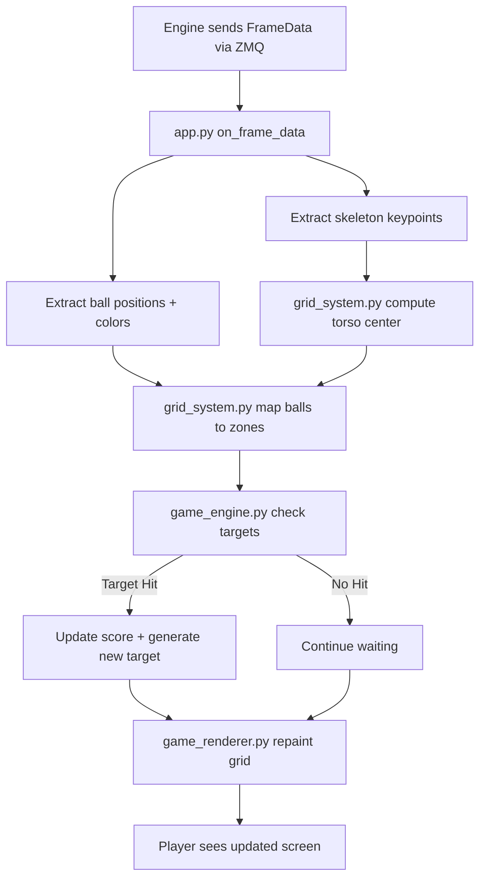

# Ball Placement Game — "JuggleDDR" App Plan

**Created:** 2026-04-02 11:10:00 CST  
**Status:** Draft — awaiting user review

---

## 1. Game Concept

A DDR-like juggling game where a screen displays a grid showing the player where to place colored balls relative to their body. The camera watches the player, and the engine tracks both the player's skeleton (body center) and the 3 LED balls (yellow, pink, green). When a ball is placed in the correct grid zone, the player scores a point and a new target appears.

### Core Loop
```
Screen shows: "Put GREEN ball in UPPER-RIGHT"
  → Player moves green ball to their upper-right
  → Engine detects green ball is in the upper-right zone relative to player's torso
  → Score! New target appears on screen
  → Repeat
```

### Key Design Decisions
- **Grid is body-anchored**: The 3D grid zones are computed relative to the player's torso center (midpoint of shoulders + hips from COCO skeleton). If the player moves, the grid moves with them.
- **Screen grid is fixed visually**: The on-screen display is a consistent grid of squares. A colored square means "put that color ball in that zone."
- **Separate window**: The game runs as a standard JuggleHub app (PyQt6 window) that can be dragged to the second monitor.
- **3 fixed-color LED balls**: Yellow, pink, green. No WiFi ball control needed for v1.
- **No engine changes needed**: All required data (ball positions, colors, skeleton keypoints) is already streamed via protobuf.

---

## 2. Data Available from Engine

Every frame, the app receives a `FrameData` protobuf message containing:

| Data | Source | What We Use |
|------|--------|-------------|
| `hands[].keypoints[]` | COCO 17 keypoints | Shoulders (5,6), hips (11,12) → compute torso center |
| `balls[]` | Ball tracker | `position` (3D), `color_name`, `logical_id`, `status` |
| `ball_states[]` | Throw/catch system | `state` (IN_FLIGHT, HELD, TRANSITIONING) |
| `frame_width`, `frame_height` | Camera | For 2D projection reference |

### Body Center Calculation
```
torso_center = average(left_shoulder, right_shoulder, left_hip, right_hip)
```
Using COCO keypoint indices: 5 (left shoulder), 6 (right shoulder), 11 (left hip), 12 (right hip).

### Grid Zone Mapping (3x3 example)
The 3D space around the player is divided into a grid. Using the torso center as origin, zones are defined by offsets in the X (left-right) and Y (up-down) axes:

```
         LEFT        CENTER       RIGHT
         (-X)         (0)          (+X)
  UP    ┌─────────┬─────────┬─────────┐
  (+Y)  │ UL      │ UC      │ UR      │
        ├─────────┼─────────┼─────────┤
  MID   │ ML      │ MC      │ MR      │
  (0)   ├─────────┼─────────┼─────────┤
  DOWN  │ DL      │ DC      │ DR      │
  (-Y)  └─────────┴─────────┴─────────┘
```

Zone boundaries are computed from the player's body dimensions (shoulder width, torso height) so the grid scales naturally to different body sizes.

---

## 3. Game Modes

### Mode 1: Classic (DDR-Style)
- One target at a time: a single grid cell lights up with a ball color
- When the ball reaches the zone, score a point, new target appears
- Speed increases gradually (less time to place each ball)
- **Scoring**: Points per successful placement, bonus for speed

### Mode 2: Multi-Target
- Multiple cells active simultaneously (e.g., "yellow upper-left AND pink lower-right")
- All targets must be satisfied to advance
- Complexity increases: 1 target → 2 targets → 3 targets (all balls placed)

### Mode 3: Endurance
- Targets appear one at a time, no time pressure
- Game ends when a ball is dropped (leaves tracking for too long)
- **Scoring**: Total successful placements before drop

### Mode 4: Countdown
- Each target has a visible countdown timer on screen
- Must place the ball before the timer expires
- Timer gets shorter as the game progresses
- **Scoring**: Points per placement, penalty for expired targets

### Mode 5: Time Attack
- Fixed time limit (30s, 60s, 90s, 120s)
- Get as many correct placements as possible
- **Scoring**: Total placements in the time window

### Future Modes (not in v1)
- **Anti-Zones**: Red zones where balls must NOT be (adds avoidance challenge)
- **Hold Zones**: Ball must be HELD (not in flight) in a specific zone
- **Sequence Mode**: A sequence of placements shown in advance, must be done in order
- **WiFi Ball Mode**: App controls ball colors dynamically via UDP

---

## 4. Architecture

### File Structure
```
hub/apps/ball_placement_game/
├── __init__.py              # Package marker
├── metadata.json            # App metadata for discovery
├── app.py                   # Main app class (BaseApp subclass) — entry point, wiring
├── game_engine.py           # Game state machine, scoring, mode logic
├── grid_system.py           # Body-anchored grid zone computation
├── game_renderer.py         # PyQt6 widget that draws the game screen
└── game_config.py           # Constants, colors, grid sizes, timing configs
```

### Module Responsibilities

#### `app.py` — App Entry Point (~120 lines)
- Subclasses `BaseApp`
- Creates the game window with menu/mode selection
- Receives `FrameData` from engine via `on_frame_data()`
- Extracts skeleton + ball data, passes to `game_engine`
- Emits Qt signals for thread-safe UI updates

#### `game_engine.py` — Game Logic (~200 lines)
- State machine: `MENU → CALIBRATING → PLAYING → PAUSED → GAME_OVER`
- Manages current mode, score, timer, difficulty progression
- Each frame: receives ball positions + body center → checks if targets are hit
- Generates new targets when current ones are satisfied
- Tracks statistics (hits, misses, streaks, average response time)

#### `grid_system.py` — Spatial Grid (~150 lines)
- Computes torso center from skeleton keypoints
- Defines grid zones as 3D bounding volumes relative to torso center
- Zone size scales with player's body dimensions (shoulder width × torso height)
- `get_ball_zone(ball_3d_pos, torso_center, body_scale)` → returns grid cell or None
- Handles missing/low-confidence keypoints gracefully (use last known position)

#### `game_renderer.py` — Visual Display (~250 lines)
- Custom `QWidget` that paints the game screen
- Draws the grid with colored cells for active targets
- Shows score, timer, streak, mode indicator
- Animated transitions when targets are hit (flash, fade)
- Clean, high-contrast design readable from a distance while juggling
- Countdown overlay per cell (for Countdown mode)

#### `game_config.py` — Configuration (~60 lines)
- Ball colors: `{"yellow": "#FFD700", "pink": "#FF69B4", "green": "#00FF00"}`
- Grid dimensions (3×3 default, 4×4 for advanced)
- Zone tolerance (how close the ball needs to be to count)
- Timing constants per mode
- Difficulty progression curves

### Data Flow



---

## 5. Screen Design

### Game Screen Layout (while playing)
```
┌──────────────────────────────────────────────┐
│  🎮 JuggleDDR          Mode: Classic    ⚙️   │
├──────────────────────────────────────────────┤
│                                              │
│   ┌────────┐  ┌────────┐  ┌────────┐       │
│   │        │  │        │  │ 🟢     │       │
│   │        │  │        │  │ GREEN  │       │
│   └────────┘  └────────┘  └────────┘       │
│                                              │
│   ┌────────┐  ┌────────┐  ┌────────┐       │
│   │        │  │        │  │        │       │
│   │        │  │        │  │        │       │
│   └────────┘  └────────┘  └────────┘       │
│                                              │
│   ┌────────┐  ┌────────┐  ┌────────┐       │
│   │        │  │        │  │        │       │
│   │        │  │        │  │        │       │
│   └────────┘  └────────┘  └────────┘       │
│                                              │
├──────────────────────────────────────────────┤
│  Score: 12    Streak: 5🔥    Time: 01:23    │
└──────────────────────────────────────────────┘
```

### Multi-Target Example
```
┌────────┐  ┌────────┐  ┌────────┐
│ 🟡     │  │        │  │ 🟢     │
│ YELLOW │  │        │  │ GREEN  │
└────────┘  └────────┘  └────────┘
┌────────┐  ┌────────┐  ┌────────┐
│        │  │        │  │        │
│        │  │        │  │        │
└────────┘  └────────┘  └────────┘
┌────────┐  ┌────────┐  ┌────────┐
│        │  │ 🩷     │  │        │
│        │  │ PINK   │  │        │
└────────┘  └────────┘  └────────┘
```

### Visual Design Principles
- **Dark background** (#1a1a2e) — matches hub theme, easy on eyes
- **Large, bold grid cells** — visible from 2+ meters while juggling
- **High-contrast ball colors** — yellow (#FFD700), pink (#FF69B4), green (#00FF00)
- **Empty cells**: subtle dark border, no fill
- **Active cells**: filled with ball color + color name text
- **Hit animation**: brief bright flash → fade to empty
- **Score bar**: always visible at bottom, large font

---

## 6. Grid Zone Detection Logic

### How "ball is in zone" works:

1. **Compute body center** from skeleton keypoints (average of shoulders + hips in 3D)
2. **Compute body scale** from shoulder width (distance between keypoints 5 and 6)
3. **Define zone boundaries** as offsets from body center, scaled by body dimensions:
   - X zones: `[-1.5w, -0.5w]`, `[-0.5w, 0.5w]`, `[0.5w, 1.5w]` where `w = shoulder_width`
   - Y zones: `[0.3h, 1.0h]`, `[-0.3h, 0.3h]`, `[-1.0h, -0.3h]` where `h = torso_height`
4. **For each tracked ball**: compute its position relative to body center, determine which zone it falls in
5. **Match against active targets**: if ball color matches target color in that zone → HIT

### Tolerance & Smoothing
- Zone boundaries have a small overlap margin (hysteresis) to prevent flickering
- Ball position is smoothed over 3-5 frames to avoid false triggers from in-flight balls
- Only TRACKED or HELD balls count (not PREDICTED)
- Ball must be in zone for a minimum number of consecutive frames (e.g., 5 frames ≈ 170ms at 30fps) to register as "placed"

---

## 7. Implementation Steps

### Phase 1: Core Infrastructure
1. Create `hub/apps/ball_placement_game/` directory structure
2. Create `metadata.json` for app discovery
3. Create `game_config.py` with constants and color definitions
4. Create `grid_system.py` with body center computation and zone mapping
5. Create `game_engine.py` with state machine and Classic mode
6. Create `game_renderer.py` with grid drawing widget
7. Create `app.py` wiring everything together

### Phase 2: First Playable (Classic Mode)
8. Implement single-target generation in game_engine
9. Implement hit detection (ball in correct zone)
10. Implement score tracking and display
11. Implement difficulty progression (faster targets)
12. Test with live engine + 3 LED balls

### Phase 3: Additional Modes
13. Add Endurance mode (drop detection ends game)
14. Add Countdown mode (per-target timers)
15. Add Time Attack mode (fixed time limit)
16. Add Multi-Target mode (multiple simultaneous targets)

### Phase 4: Polish
17. Add hit/miss sound effects (optional, using hub audio system)
18. Add game-over screen with statistics
19. Add mode selection menu
20. Add high score persistence (JSON file)
21. Update README.md with new app documentation

---

## 8. What We Do NOT Need to Change

- **No engine changes** — all data (skeleton, balls, colors) already streamed
- **No protobuf changes** — existing `FrameData` has everything we need
- **No new dependencies** — PyQt6 already available, no external game libraries needed
- **No build changes** — pure Python app, discovered automatically by AppManager

---

## 9. Open Questions / Future Considerations

1. **Grid size**: Start with 3×3. Could add 4×4 as a difficulty option later.
2. **Z-axis (depth)**: For v1, ignore depth — only use X (left-right) and Y (up-down). Future versions could add "close to body" vs "far from body" as a third dimension.
3. **WiFi ball integration**: Future mode where the app sends UDP commands to change ball colors dynamically, making the game more varied with fewer physical balls.
4. **Anti-zones**: Red cells where balls must NOT be. Adds complexity but deferred to post-v1.
5. **Audio cues**: Could play the color name audio files already in `hub/audio/color_names/` when a new target appears. Nice-to-have for v1.
6. **Calibration step**: Brief "stand in frame" step at game start to establish body dimensions. Could auto-calibrate from first few frames instead.
